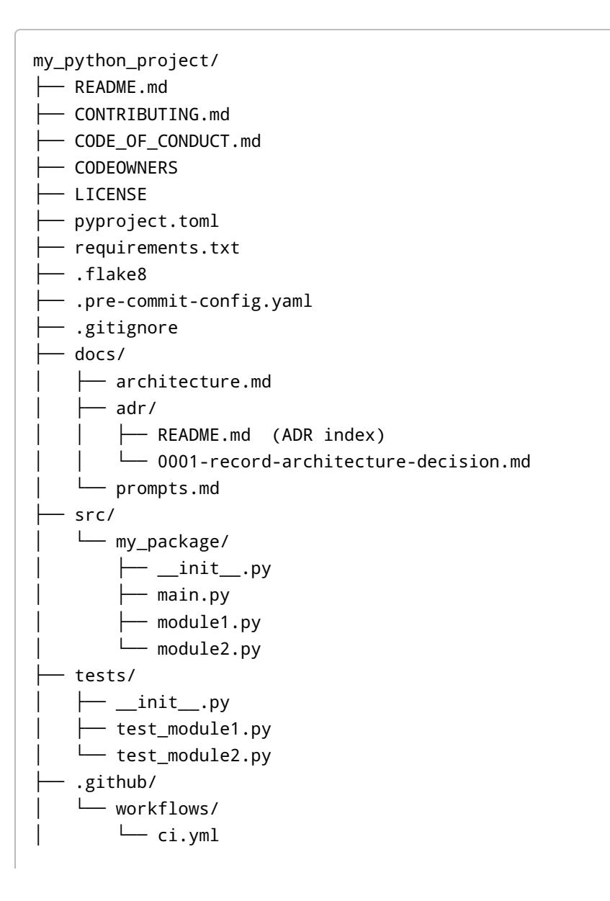
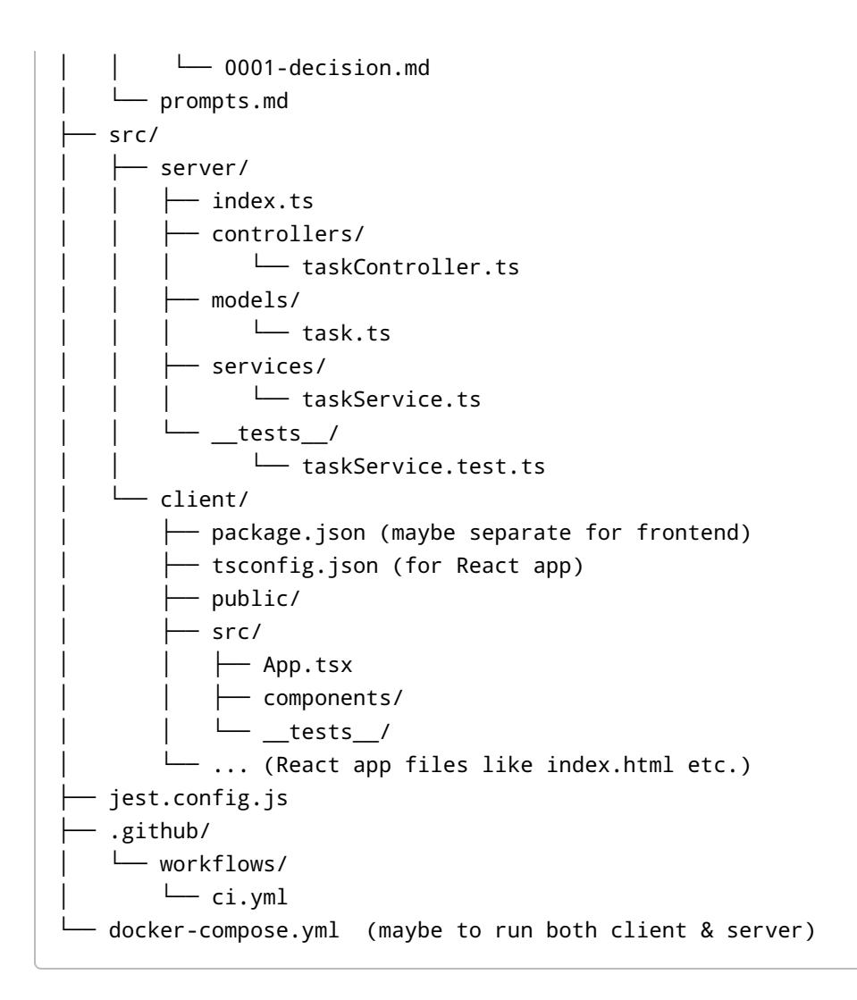

# **LLM-Assisted Software Engineering Playbook**

Developing software with the help of Large Language Model (LLM) coding agents or assistants requires careful planning and structure. This playbook compiles proven end-to-end strategies (circa 2023–2025) to keep LLM agents on task and producing correct code, files, and project structures. It is organized as a practical guide for a solo developer, including step-by-step workflows, prompt templates, repository templates, automation scripts, evaluation methods, a comparison of agent frameworks, and troubleshooting tips.

**Contents:** - **1. Upfront Project Scaffolding** – Spec-first planning, docs-driven development, acceptance criteria, Definition of Done, ADRs, test-first prompts

- **2. Repository Architecture Patterns** – Monorepo vs. polyrepo, layering and modular boundaries, naming conventions

- **3. LLM-Specific Development Techniques** – Context management (repo maps, symbol graphs, code retrieval), structured outputs and schemas, tool use, iterative diff workflows, small PRs and reviews, task breakdown, loops with validation, guardrails (file allowlists, regex/AST checks, linters, type checking, CI gates)

- **4. Workflow: Idea to Release** – Step-by-step checklist from project idea → spec → scaffold → code → tests → docs → release

- **5. Prompt Templates for Each Phase** – System/user prompt patterns for planner, architect, scaffolder, implementer, tester, reviewer, refactorer (with example JSON schemas and notes on what not to do)

- **6. Repository Templates (Python & TypeScript)** – File tree structures and sample files: README, CONTRIBUTING, CODEOWNERS, ADR template, prompts.md, pyproject.toml/package.json, lint/format configs, test configs (pytest/jest), coverage, pre-commit, Dockerfile/devcontainer, CI YAML

- **7. Automation Snippets** – Scripts for scaffolding a project structure, generating a "repo map," indexing code embeddings, a GitHub Action enforcing structure & tests (rejecting invalid LLM output), and a guardrail script blocking disallowed file writes

- **8. Evaluation and QA** – Guidance on evaluating agent output with a lightweight benchmark (SWE-bench style), success metrics (task success rate, tests passing, diff size, review feedback), and triage loops for failures

- **9. Frameworks & IDE Workflow Comparison** – Matrix of agent frameworks (SWE-Agent, AutoGen, OpenDevin, Smol Developer, etc.) and IDE-based tools (Cursor, Copilot, Aider, Codeium), with use-case recommendations

- **10. Troubleshooting Common Failure Modes** – Spec drift, context loss, file thrash, hallucinated paths, flaky tests, etc., with concrete mitigations

Each section cites real projects, research papers, and engineering blogs (2023–2025) with brief annotations. The aim is to provide actionable guidance – **checklists, templates, and code snippets** you can readily apply – rather than theory.

# **1. Upfront Project Scaffolding**

Successful LLM-assisted projects start with a strong upfront plan. This means clearly defining **what to build and how to validate it before coding begins**. Key techniques include writing specifications first (docsdriven development), enumerating acceptance criteria and "Definition of Done," capturing design decisions in ADRs, and using test-first prompts to guide implementation.

- **Spec-First / Docs-Driven Development:** Before prompting an LLM to write code, articulate the requirements and design in natural language or formal docs. For example, write a short Product Requirement Document (PRD) or technical spec describing features, APIs, data models, etc. _Rationale:_ The spec can be provided to the LLM as context, ensuring the model has a correct understanding of the goals. This reduces hallucinations and mid-course drift. If available, leverage existing documentation or user stories as part of the prompt. Major orgs often practice docs-driven dev to align teams; the same helps align your LLM assistant. •
- **Acceptance Criteria & Definition of Done (DoD):** List concrete criteria that the output must meet to consider the task complete. This may include functional requirements ("able to handle 1000 requests/sec"), passing specific tests, code style guidelines, documentation completeness, etc. For instance, the **roocode SPARC** project's SWE-bench integration defines success criteria like all tasks automated via the agent (no manual steps), orchestrator delegation working, performance targets met, and full documentation . Such checklists can double as a "Definition of Done" for the LLM: the agent shouldn't stop until those boxes are ticked. _Include these criteria in your system prompt_ or as a final verification step. • [1](https://github.com/agenticsorg/sparc-bench/blob/fd813484f533ab118a963766475f8f3edacb64e1/README-swe-bench.md#L266-L274)
- **Architecture Decision Records (ADRs):** Maintain a log of key design decisions in the repo (usually as markdown files in an /adr directory). ADRs are short docs explaining a choice (e.g. "Use PostgreSQL vs MySQL – Decision: PostgreSQL because X..."). While not specific to LLMs, writing an ADR for major decisions (or even prompting the LLM to draft one after a design discussion) can ensure rationale is captured. It's also a form of spec that can be fed back into the LLM context if needed (to remind it why a certain architecture was chosen). A template ADR might include sections: Context, Decision, Status, Consequences. This helps keep the LLM's outputs consistent with earlier decisions (reducing backtracking). •
- **Test-First Prompts & TDD:** Adopting test-driven development with an LLM means writing tests or at least test _prompts_ before implementation. For example, you might prompt the LLM: "First, write a set of unit tests for the UserService (in pytest style), focusing on X behavior. Then implement UserService to make those tests pass." This approach keeps the LLM focused on satisfying the spec as encoded in tests. Many LLM coding frameworks encourage breaking the work into small, test-backed steps. _Field example:_ A Cursor IDE user devised a prompt sequence for **TDD project planning**, where the LLM (as a "Principal Engineer" persona) outputs an executable plan decomposed into incremental, test-first tasks . Each unit of work in the plan includes the test scaffolding or expectations and a small code task, ensuring that when implemented, it can be verified immediately. This method yields a series of self-contained prompts (often stored in a plans/ folder) that the developer or agent can then execute one by one. By planning with tests up front, you catch ambiguities early and give the LLM a clear target for each coding step. • [2](https://github.com/nmrs/sotd_pipeline/blob/62a50a30aa96378491dc6824f5a67a1d52af4cbc/.cursor/prompts/tdd-project-planning.mdc#L7-L15) [3](https://github.com/nmrs/sotd_pipeline/blob/62a50a30aa96378491dc6824f5a67a1d52af4cbc/.cursor/prompts/tdd-project-planning.mdc#L18-L26)

**Upfront Planning Checklist:** 1. **Write a Project Brief:** a one-pager explaining the project's goal, key features, and constraints. Keep it for prompting. 2. **List Requirements & DoD:** bullet out what the solution _must_ do (functional requirements) and any quality criteria (performance, security, etc.). Also list "done when…" items. Share this list with the LLM . 3. **Outline Architecture:** decide high-level structure (tiered layers, main components, external services). Note any known design decisions (and record in ADR format if significant). 4. **Prepare Examples or API Schemas:** If building an API or module, provide examples of inputs/outputs or an interface spec. LLMs given a schema can fill in the implementation. 5. **Draft Tests or Use Cases:** Write a few critical user scenarios or unit tests (in plain language or actual test code). You might start with a simple test to guide the LLM ("Given this input, the output should be…") to anchor the development. 6. **Plan Iterations:** Break the work into small tasks (ideally each taking the LLM a single prompt-response to complete). For each task, define what will be implemented and how it will be validated (e.g. "Task 1: Implement data model classes – validated by running associated unit tests for models"). The Smol-Developer approach exemplifies this: it generates a plan outlining the app structure, then proceeds file by file . 7. **Review Feasibility:** Ensure the plan's steps are not too broad (risking many bugs) and not too granular (risking integration difficulties). _Insight:_ The GPT-Pilot team found that task size significantly affects code quality – overly broad tasks yield buggy output, while overly narrow ones can confuse the model's integration of changes . Aim for a middle ground. 8. **Finalize Prompts for Planning Phase:** Formulate a "Planning prompt" for the LLM (or chain-of-thought agent) that feeds it the above info and asks for a project plan. For example: _"You are a senior engineer. Here is the project brief... Please produce a step-bystep implementation plan with a file list, function signatures, and for each step, tests or criteria for completion."_ You may use a system message to enforce format (JSON or markdown checklist). [1](https://github.com/agenticsorg/sparc-bench/blob/fd813484f533ab118a963766475f8f3edacb64e1/README-swe-bench.md#L266-L274) [4](https://github.com/wasp-lang/wasp/blob/0c6b0be9b0f6b9b47e12595b6c4146e454bc2293/web/blog/2023-08-01-smol-ai-vs-wasp-ai.md#L72-L80) [5](https://github.com/Pythagora-io/gpt-pilot/blob/186f98e3a75cc0b5e33c266b0ceccce176dc43ee/README.md#L202-L205)

By investing in upfront scaffolding, you greatly increase the changes that your LLM assistant builds the _right_ thing and knows when it's done.

# **2. Repository Architecture Patterns**

How you structure your repository and code modules can either help or hinder an LLM. Consistent, clear structure makes it easier for an agent to navigate the codebase and adhere to intended boundaries. Here we discuss monorepo vs. polyrepo, layering, modular boundaries, and naming conventions, with an emphasis on what works well for LLM-driven development.

**Monorepo vs. Polyrepo:** In a **monorepo**, all code (multiple projects, services, packages) lives in one repository. In a **polyrepo**, you maintain multiple repos (e.g. one per service or package). For a solo developer or a single project, a monorepo is often simpler – everything in one place means the LLM has access to all context without needing cross-repo coordination. Monorepos encourage standardized tooling and shared conventions. As one engineer noted, a healthy _"monorepo culture"_ has unified dev tools, one release cycle, and collective code ownership (everyone responsible for keeping main branch green) . This culture can foster collaboration and agility – developers (or AI agents) can move between components easily since everything uses the same setups . On the other hand, large monorepos can become unwieldy if not managed, requiring robust tooling for build, test, and code search as the repo scales (common at big companies). Polyrepos modularize concerns and can simplify CI for each component, but they introduce **dependency hell** when many small repos depend on specific versions of each other . For an LLM agent, polyrepos pose additional challenges: the agent might need context from another repo (which may not be accessible in the prompt due to context length or auth). If you do use multiple repos (e.g. separate backend • [6](https://github.com/kadhirvelm/resync-games/blob/84d62d0a4face8225d5bbdfd96d14a91cd7758a6/packages/frontend/src/app/blog/engineering/monorepo-culture/page.tsx#L38-L46) [7](https://github.com/kadhirvelm/resync-games/blob/84d62d0a4face8225d5bbdfd96d14a91cd7758a6/packages/frontend/src/app/blog/engineering/monorepo-culture/page.tsx#L56-L64) [8](https://github.com/kadhirvelm/resync-games/blob/84d62d0a4face8225d5bbdfd96d14a91cd7758a6/packages/frontend/src/app/blog/engineering/monorepo-culture/page.tsx#L12-L20)

and frontend), consider pulling relevant files from the other repo into the prompt as needed, or use a vector database to let the agent retrieve snippets across repos.

_Guidance:_ For solo projects or tightly related components, prefer a monorepo. Use folder structure to separate concerns (e.g. backend/ vs frontend/ ). If using polyrepo (say, publishing a library separate from an app), you'll have to either run the agent separately per repo or give it tools to fetch from other repos. Many "AI junior developer" tools default to a single workspace directory (monorepo style) for simplicity . Even OpenAI's function-calling agent examples assume one working directory. So, unless you have a strong reason, start monorepo, perhaps splitting out later if needed (when an LLM can help with the refactor). [9](https://github.com/dxdyt/blog-web/blob/1b7415b94f50f69302ea0850019fdc12f56e61ca/content/posts/OpenDevin.md#L52-L60) [10](https://github.com/dxdyt/blog-web/blob/1b7415b94f50f69302ea0850019fdc12f56e61ca/content/posts/OpenDevin.md#L68-L76)

- **Layered Architecture & Modular Boundaries:** Enforce logical boundaries within the code. This could mean adopting a known architecture pattern (MVC, Clean Architecture, Hexagonal, etc.) or simply separating by feature or tier. For example, in a web app, you might have distinct folders for api/ , services/ , data/ models, ui/ , etc. Clear separation helps the LLM keep context localized: if it's working on a database function, it should only need to consider the data/ layer, not everything. _Tip:_ Include brief README.md files in each major folder explaining that module's purpose and any conventions. An LLM can read those to understand your architecture. When generating new code, prompt it to put files in the correct layer. If it proposes putting business logic in a controller file, remind it of the designated service layer. A modular design also means you can run partial tests (e.g. test just the data layer) as validation for the LLM's output on that part, before moving on. •
- **Naming Conventions:** Adopt consistent naming for files, folders, functions, and classes. LLMs are less likely to hallucinate or misplace code if your naming is descriptive and structured. For instance, if you suffix interface files with ...Interface.ts or prefix test files with test\_ , maintain that everywhere. When the LLM creates a new file, explicitly tell it the naming scheme: _"Create a new service class in user_service.py (all services use \_service.py suffix)."_ Consistent naming also aids vector search over code: if you later use embeddings to find where a function is defined, having a predictable name increases the chance of a hit. •

One particularly helpful convention for LLM context is to include the purpose in the filename. E.g., UserRepository for data access vs. UserService for business logic, vs. UserRoutes for HTTP endpoints. Then if the LLM is tasked to add a new feature in user logic, it can guess which files to open. Projects like **Smol-Developer** explicitly plan out file names and their roles in advance , so that generation of each file is guided by the intended responsibility. Adopting a similar approach (maybe maintaining a ARCHITECTURE.md or MAP.md that lists each file's role) will assist any agent in navigating the repo. [11](https://github.com/wasp-lang/wasp/blob/0c6b0be9b0f6b9b47e12595b6c4146e454bc2293/web/blog/2023-08-01-smol-ai-vs-wasp-ai.md#L74-L81)

**Monolith vs. Microservices:** Related to monorepo/polyrepo is whether your app is deployed as a single unit or multiple services. For an LLM building the project, a monolithic architecture (single deployable, even if logically layered) is simpler to handle initially. Microservices introduce network calls, separate configs, and more points of failure – if you go that route, be prepared to specify each service's API clearly to the LLM and maybe generate them one at a time. In general, **start simple (monolith)** and only break out services if absolutely needed. This reduces the cognitive load on the LLM and avoids cross-service context switching. •

**Repo Structure & Architecture Checklist:** - Choose monorepo (single repo) unless strong reason otherwise. If multiple repos, ensure the agent has read-access to all or you provide stubs. - Create a clear directory structure reflecting layers or features. Document this structure in a top-level README.md (with a "Project Structure" section listing directories and their purpose). - Establish naming conventions (filenames, function names, etc.). Document any special patterns. - Provide the LLM with an **initial scaffold** of folders and empty files if possible. This "scaffolding" acts as a guide rail – the model will fill in the blanks rather than create files everywhere. (See Section 7 for an automatic scaffold script.) - For multi-language repos (say a Python backend and TypeScript frontend in one), separate them cleanly (different root folders) and clarify build/test processes for each. - Include configuration files from the start (even if empty placeholders): e.g., an empty pyproject.toml , a sample package.json , CI workflow file, etc. The LLM will then know these exist and can modify them as needed rather than creating new ones in the wrong place. - If using an agent that operates via commands, ensure it has tools for navigating the structure (e.g., a custom ls or search command). The SWE-Agent research from Princeton introduced a file viewer command that lists directory contents in 100-line chunks , which was critical to help the LLM browse without getting lost. A similar approach can be to maintain an updated file tree in the prompt or allow the agent to query it easily. [12](https://github.com/ozyyshr/RepoGraph/blob/6c3977d87845993bf2c0359b4ac752278d7f3c45/SWE-agent/README.md#L36-L43)

**Layering Tip:** If your project has clearly defined API boundaries (e.g., "frontend calls backend via REST"), consider writing an **API contract first** (like an OpenAPI spec or TypeScript interface). Provide this to the LLM so it doesn't hallucinate endpoints. Keeping interface definitions in one place (and pinned in context) helps the model stay consistent while implementing different parts.

# **3. LLM-Specific Development Techniques**

Building software with LLMs isn't just "normal coding, but faster." It requires new techniques to steer the AI and manage its unique failure modes. Below are techniques that practitioners have found effective in the wild (with references to papers, OSS projects, and blogs):

## **3.1 Context Management: Repo Maps, Symbol Graphs, Retrieval**

LLMs have limited memory (context window), so feeding an entire codebase is impractical. Successful agent strategies involve giving the model _just the relevant context_ for each task, often by using **repo maps or code summaries**:

- **Repository Map / Tree Summary:** Provide an outline of the codebase e.g., a tree of files and a one-line description of each. This acts like a map so the LLM knows where things are. Some tools auto-generate this. For instance, _Smol-Developer's initial plan includes the structure of the entire app and file-level descriptions_ . Another approach is to maintain an updated "README-map.md" file in the repo that lists modules, or to have the LLM generate a summary of each file (docstrings or comments can help here). If you have such a map, include it in the prompt when the LLM is adding new features – it will ground the model in the existing structure. • [4](https://github.com/wasp-lang/wasp/blob/0c6b0be9b0f6b9b47e12595b6c4146e454bc2293/web/blog/2023-08-01-smol-ai-vs-wasp-ai.md#L72-L80)
- **Symbol Graph or Index:** This is a more granular map of the code symbols (functions, classes, etc.) and their relations. Some research prototypes build a graph of code entities for the LLM to consult. In practice, you can approximate this by letting the LLM do a project-wide search for a symbol. For example, if the agent needs to find where Order.calculateTotal is defined, a tool can grep or search an index to show that snippet. Several IDE extensions (like Sourcegraph's Cody, or VSCode with Codeium) provide semantic search over the repo. In our context, you can simulate this by prebuilding an **embedding index** of the code (see Section 7 for a snippet) and then on each query, retrieving the top relevant code chunks to include in the prompt. _Ex:_ GPT Pilot uses mechanisms to •

filter code context so that "in each LLM conversation, it doesn't need to store the entire codebase in context – only the relevant code for the current task" . This allowed GPT Pilot to scale to larger projects without running out of context. The bottom line: equip your workflow with the ability to retrieve code by relevance, not blindly stuff all code in. [13](https://github.com/Pythagora-io/gpt-pilot/blob/186f98e3a75cc0b5e33c266b0ceccce176dc43ee/README.md#L196-L200)

- **External Documentation as Context:** If the project relies on frameworks or APIs, consider retrieving docs or examples for those and feeding them to the LLM when needed. LangChain and LlamaIndex provide patterns for retrieval-augmented generation (RAG). For example, if working on a React component and using a specific library, you might have a vector store of that library's usage examples and inject the most similar one when the LLM is coding. This reduces hallucination about library usage. •
- **Interactive Browsing Tools:** Agents like SWE-Agent introduced specialized commands for browsing code: a file viewer that can scroll and search within files . If you're building a custom agent, giving it these abilities is crucial. In a simpler setup, you as the developer can do the navigation: when ChatGPT asks "Where is function X defined?", you can copy-paste it. But fully automated agents need search tools. For solo devs, a happy medium is using a CLI assistant (like aider or Github Copilot Chat ) that has inline search features or at least allows quick open of files. • [12](https://github.com/ozyyshr/RepoGraph/blob/6c3977d87845993bf2c0359b4ac752278d7f3c45/SWE-agent/README.md#L36-L43)

**Tip:** Maintain _up-to-date documentation strings and comments_. LLMs strongly rely on in-code comments to understand intent. If every function has a docstring, the model can use that to decide how to modify or use the function. AutoDoc tools (like context-labs/autodoc which generates codebase documentation with GPT ) can help create these summaries. [14](https://github.com/underlines/awesome-ml/blob/81c7bdf6fd008bcc48308306194491a5748cf35d/llm-tools.md#L409-L413)

## **3.2 Structured Outputs: JSON Schemas, Typed Formats, and Function Calling**

One way to control LLM outputs is to ask for **strictly structured responses**. For example, you might instruct the model to output a JSON object with specific fields (which you then parse), or to adhere to a Pydantic/TypeScript schema. This is especially useful for intermediate steps like planning or for tools that consume LLM output (like an automated CI check expecting a JSON test report).

- **Plan/Spec in JSON:** You can prompt the LLM to produce a plan in JSON (e.g., an array of steps, each with a description and list of files to create). This makes it easier to parse and feed into automation. OpenAI's GPT-4 can be given a JSON schema via the system message or using function calling to enforce structure. Many agent frameworks use this for the planning phase. _However_, experience shows that when it comes to actual code, rigid formats can backfire. For instance, an attempt to have GPT output diffs or code embedded in JSON often fails because of escaping issues or context loss . Paul Gauthier (creator of aider ) noted that wrapping code in JSON leads to syntax errors and model confusion – _"GPT is worse at editing code if you use [structured formats like JSON]. ...Due to escaping issues, GPT's code is often syntactically incorrect when unpacked from JSON"_ . So use structured output where it makes sense (structured data, plans, test results) but be cautious about using it for large code blobs. • [15](https://github.com/Lesterpaintstheworld/aider/blob/61082ffd941ec0f26b735c50c42476c755d6be69/website/docs/unified-diffs.md#L125-L133) [16](https://github.com/Lesterpaintstheworld/aider/blob/61082ffd941ec0f26b735c50c42476c755d6be69/website/docs/unified-diffs.md#L134-L142)
- **Function Calling API:** With GPT-4 and newer models, you can define "functions" that the model can call with JSON arguments. This is powerful for tools (e.g., a create_file function that takes {path, contents} as args). In an agent scenario, you might have functions like open_file(path) , run_tests() , etc. The model, if properly prompted, will output a JSON that •

the API interprets as a function call. This guarantees structured input to your tools. Projects like LangChain, AutoGen, and others allow defining such tools easily. For example, _OpenAI's function calling was tested as a way to have GPT produce code edits_ (by calling an edit_code function with location and changes). The SWE-Agent paper also suggests that well-designed interfaces ("Agent-Computer Interface") improve reliability . They implemented commands instead of raw text for actions like browsing or editing, which made the agent more effective. If you implement function/ tools: keep them **simple and orthogonal** (each does one thing clearly). Also handle errors – e.g., if the model calls a function with invalid JSON (common if it slightly deviates), you need to catch that and perhaps remind the model to conform. [17](https://github.com/ozyyshr/RepoGraph/blob/6c3977d87845993bf2c0359b4ac752278d7f3c45/SWE-agent/README.md#L32-L40)

**Schemas for Validation:** If not using the API-level function calling, you can still enforce output schema by post-processing the LLM output with a parser like Pydantic (for Python) or a JSON schema validator. A pattern is: "If the output is not valid according to this schema, ask the model to correct it." Some OSS libraries (like _GuardrailsAI_) provide a wrapper to do this automatic checking and correction loop. This is great for outputs like config files, JSON outputs for another service, etc. _Example:_ If generating a CI workflow YAML, you might run it through a linter or YAML parser to ensure validity; if broken, prompt the LLM with the error to fix it. •

**Key Point:** There is a tension between structured output and code generation. Structured formats shine for non-code or meta-output, whereas for code, using the code's _native format_ (diff, full file text, etc.) tends to work better. In fact, aider's research found that asking GPT-4 to output unified diffs (a format it "knows" from training) drastically improved quality and reduced lazy errors . The diff format is structured, but in a way that is natural for code. The model treated it more rigorously, as if it knew a program (patch) would read it, leading to fewer omissions . So, "structured output" might also mean choosing a format the model is comfortable with. This leads to the next technique: [18](https://github.com/Lesterpaintstheworld/aider/blob/61082ffd941ec0f26b735c50c42476c755d6be69/website/docs/unified-diffs.md#L50-L59) [19](https://github.com/Lesterpaintstheworld/aider/blob/61082ffd941ec0f26b735c50c42476c755d6be69/website/docs/unified-diffs.md#L62-L70) [18](https://github.com/Lesterpaintstheworld/aider/blob/61082ffd941ec0f26b735c50c42476c755d6be69/website/docs/unified-diffs.md#L50-L59)

## **3.3 Incremental Development: Patch/Diff Workflow and Small Commits**

Rather than having the LLM emit entire files or entire projects in one go, a proven strategy is an **iterative diff-based workflow**: - The agent or assistant makes changes in small increments (like a Git patch) which can be reviewed or tested, then more changes are made. This mimics how a developer might make a series of commits. - The unified diff format (the output of git diff -U ) is a handy way to represent changes. It's line-based, shows context, and the LLM likely has seen many diffs during training. As noted, switching GPT-4 to output unified diffs made it _3x less likely to produce incomplete "lazy" code_ compared to a previous format . It essentially forces the model to be precise about what to change. - Tools like aider now default to a diff-based editing: you prompt what you want, and it returns a diff of changes to apply to your code. This has the benefit of not regurgitating the entire file (avoiding model mistakes in parts of the file you didn't intend to change). It also integrates well with version control – you can apply the diff as a patch and commit. [20](https://github.com/Lesterpaintstheworld/aider/blob/61082ffd941ec0f26b735c50c42476c755d6be69/website/docs/unified-diffs.md#L34-L42)

For example, if you want to add a feature to a function, an interactive agent can retrieve the file, then you instruct "Add feature X to function Y," and the agent produces a diff snippet adding those lines. You apply it, run tests, and iterate. This keeps the context window usage efficient (only the relevant file part and diff are in play).

**Small PRs & Review Prompts:** Similar to diffs, think in terms of _Pull Requests_ of limited scope. When using an LLM, it's wise to aim for one feature or bugfix per PR. After each, you or the agent run tests and possibly do a review. Some workflows even include an LLM _reviewer_ agent that checks the diff for potential issues or ensures it meets the spec (acting like a second pair of eyes). You can prompt ChatGPT: "Review the following diff for any mistakes or deviations from the requirements," and it will highlight issues. This is a guardrail before code merges.

Another trick: after the LLM generates code, ask it to explain the code. If the explanation doesn't match the intention, that's a red flag to fix. Some developers include an assistant prompt like "summarize how the new code works" as a way to verify understanding.

## **3.4 Task Decomposition and Checklisting**

Even with a high-level plan (from Section 1), when coding starts it's easy for the LLM to get off track or for requirements to slip through the cracks. Using explicit **checklists and breakdowns in prompts** can mitigate this.

- **Decompose Goals in Prompts:** Before generating code, have the LLM restate or list sub-tasks it's about to do. For instance, "First, I will create the database model for X, then update the API endpoint, then adjust tests." This ensures it has a plan for the current prompt. If it misses something in the list, you catch it early. You can instruct the LLM to always outline its approach before writing code (some refer to this as the "chain-of-thought" or self-reflection step). •
- **Use To-Do Lists:** Some agents prompt the model to output a checklist [ ] Step 1, [ ] Step 2, ... and then iterate on each. Others use the model to verify each requirement is addressed. A simple manual method: after code generation, ask _"Did you cover all acceptance criteria? List any missing pieces."_ The model might then realize it forgot a case and you can prompt it to implement that. •
- **One Change at a Time:** Encourage the model to focus. For example, if you need to implement two unrelated features, do them in separate interactions. This helps because the model's output won't become too large or mixed (which can confuse it and you). The **GPT Pilot** team explicitly notes that having the model code step-by-step, debugging as it goes, is more effective than "having it spit out the whole codebase at once" . By mirroring a human's iterative development process, the model can tackle issues incrementally. • [21](https://github.com/Pythagora-io/gpt-pilot/blob/186f98e3a75cc0b5e33c266b0ceccce176dc43ee/README.md#L194-L202)

## **3.5 Automated Execution Loops with Validation**

A powerful pattern is the **execute -> validate -> feedback loop**. This means after the LLM writes some code, you run something (tests, type checker, linter, or even the program) and feed results back into the LLM for fixes.

Several agent frameworks do this: - **Wasp GPT Web App Generator** (from Wasp-lang) generates the code for an app and then _"checks each file for expected errors or hallucinations and fixes them"_ . In practice, this could mean they compile the code or run a linter, see if there's a syntax error or an undefined variable, then prompt GPT to resolve it. By building this into the loop, the final output is more likely to run on first try. - **OpenAI's AutoGPT / BabyAGI** style agents often have a loop where they run tests. A refined example is **Crew** or **SWE-Agent** which run pytest after generating code and if tests fail, the assistant reads the traceback and fixes the code. - If you're not building a fully autonomous agent, you can still manually do this: whenever ChatGPT gives you code, paste any error messages or failing test outputs and say "Here's the error, please fix." The LLM will utilize that feedback effectively. [22](https://github.com/wasp-lang/wasp/blob/0c6b0be9b0f6b9b47e12595b6c4146e454bc2293/web/blog/2023-08-01-smol-ai-vs-wasp-ai.md#L160-L168)

For solo dev automation, you can script this with a simple harness: 1. Have the LLM generate code for task N. 2. Run mypy (for Python) or tsc --noEmit (for TypeScript) to catch type errors. Run your test suite. 3. If any failures, feed the error text into the next prompt: _"The following test failed…"_ or _"Type checker error: …"_ and ask to fix. 4. Loop until clean or a certain number of iterations.

This requires that you have at least some tests in place (even very basic ones). If no formal tests, you can still run the program with sample input and catch runtime errors.

**Caution:** Not all errors are easily fixed by the model (some may need design changes). Monitor if the loop is thrashing (making one change, causing another issue, etc.). If so, step in and analyze or break the problem down further.

## **3.6 Guardrails and Safe-guards**

LLMs sometimes produce outputs that violate project constraints or even common-sense boundaries (like deleting important files, writing to the wrong directory, introducing security flaws, etc.). Setting up **guardrails** can prevent or catch these issues:

- **Allowed File Operations:** If using an agent that can write files, restrict its write access. For example, run it in a container or workspace folder (as OpenDevin does by running the agent in a Docker sandbox mapped to a specific directory) – this way even if it tries to modify something outside, it can't . Define which directories it should write to. Some agents maintain an allowlist of file patterns it's allowed to touch and will refuse others. If you roll your own, implement a simple check: if the agent tries to create/modify a file not under the project root or in a DONOTEDIT folder, ignore or override that action. • [10](https://github.com/dxdyt/blog-web/blob/1b7415b94f50f69302ea0850019fdc12f56e61ca/content/posts/OpenDevin.md#L68-L76)
- **Regex/AST Checks on Outputs:** After the model gives an output (especially if it's supposed to be code), run some automatic checks. Regex can catch things like profanity (not likely in code) or usage of disallowed functions. AST-based linters can catch more: e.g., you might ban use of eval() or ensure all new code has type annotations. If a check fails, you can instruct the model to fix it: _"The code used eval which is not allowed. Please remove it."_ •
- **Code Linters/Formatters:** Always have a formatter (black, Prettier, etc.) and linter (ESLint, flake8, etc.) configured. They not only keep style consistent (which helps the LLM not get confused by inconsistent patterns) but also catch simple errors. Remarkably, **SWE-Agent** integrated a linter in its Agent-Computer Interface – whenever the agent tried to make an edit, a linter ran and if the code wasn't syntactically correct, the edit was rejected . This forced the model to only commit changes that at least parse. You can do the same: run lint in CI or pre-commit and fail if syntax broken – then have the agent fix syntax before continuing. • [12](https://github.com/ozyyshr/RepoGraph/blob/6c3977d87845993bf2c0359b4ac752278d7f3c45/SWE-agent/README.md#L36-L43)
- **Type Checking:** Especially in Python, lack of types can let subtle mistakes through. If you add type hints and run mypy, you catch many issues early. The agent will learn to satisfy the type checker (treat it like another form of test). For front-end or Node, use TypeScript to similar effect. Many agent developers have noted that encouraging the model to produce typed code reduces errors (because the model self-consistently fills types, and any mismatch is an error to fix). •

- **CI Gates:** Treat the LLM's contributions like a human PR. Set up Continuous Integration to run tests on each change (GitHub Actions, etc.). You can even automate the loop: if CI fails, have an Action that comments on the PR with the failure. A GitHub App or simple script can pipe that back to your ChatGPT with a prompt "fix based on this CI output." This is cutting-edge and may require some glue code (see Section 7 for an example of a CI guardrail action). But it closes the loop for autonomous fixes. •
- **Security and Dependency Checks:** If the project is going to production, use tools like npm audit or pip safety to catch vulnerable dependencies that the model might have added. Also consider scanning generated code with static analysis (e.g., Bandit for Python security issues). If the LLM introduces, say, a hardcoded secret or an SQL injection risk, these tools might catch it and you can then prompt a fix. •

**Real-world note:** Many of these guardrails are being actively researched. The Princeton SWE-Agent team emphasize how their interface design (like limiting how much of a file the agent sees at once, and confirming tool outputs) made a big difference in reliability . OpenAI's own "Code Interpreter" (now ChatGPT Advanced Data Analysis) runs code in a sandbox with resource limits. Following that example, keep your agent environment sandboxed and limited in what it can impact. [17](https://github.com/ozyyshr/RepoGraph/blob/6c3977d87845993bf2c0359b4ac752278d7f3c45/SWE-agent/README.md#L32-L40)

# **4. Workflow: Idea to Release**

Putting it all together, this section presents a step-by-step **workflow** from project inception to release, optimized for an LLM-assisted development process. Think of it as a recipe you can follow for each new project or feature.

**Step 1: Project Idea and Requirements** - **Capture the Idea:** Write down the project's elevator pitch. What problem does it solve? Who is the user? Keep it high-level; this is to ensure clarity of purpose. - **Define Scope for MVP:** List core features vs. nice-to-haves. (LLMs have a tendency to overbuild if not constrained.) Clearly state what's _out of scope_. - **Choose Tech Stack:** Decide language(s) and key frameworks/libraries. This will influence prompts (e.g., "We are using React and Node" or "a CLI tool in Python"). Ensure the LLM knows what stack – otherwise it might default to something else. - **Identify Constraints:** Any performance requirements, target platforms, or compliance needs? Note these.

### **Step 2: Specification and Planning**

_(Upfront scaffolding as detailed in Section 1.)_ - **Write a Short PRD/Spec:** One or two pages describing how the system should work. Include example inputs/outputs, diagrams if helpful, etc. - **List Acceptance Criteria:** "User can do X", "System must Y", and non-functionals. This doubles as the test plan. - **Architecture Outline:** Decide roughly how to structure (monolith? layers? external services?). Choose repo pattern (likely monorepo for solo dev). Sketch out major components and how they interact. - **Plan Tasks:** Break the work into a sequence of tasks. Each task should deliver a testable piece. For example: "Task 1: Implement database models. Task 2: CRUD API endpoints. Task 3: CLI interface," etc. Within each, smaller sub-steps too. - **Prompt Generation of Plan (Optional):** If unsure, you can ask the LLM to draft a plan based on the spec. Provide the spec and ask for an ordered list of steps and files to create. _Review this plan carefully and adjust._ The LLM might suggest too much at once – feel free to split steps further or merge some.

#### **Step 3: Repository Setup (Scaffolding)**

_(Also see Section 6 for templates.)_ - **Initialize Repo:** Create a new Git repository (git init). - **Repo Structure:** Create the directory layout: e.g., src/ , tests/ , etc. Use cookiecutter or templates if you have them. (Or run the scaffold script from Section 7.) - **Essential Files:** Add basic files like README.md (with a project description and maybe a todo list of tasks), .gitignore , license if needed, and placeholder config files (pyproject.toml/package.json, etc. with minimal content just to have them in place). - **ADR Log:** Add an / adr folder with a template if you plan to use ADRs. Possibly record an ADR for "Repo structure and tech choices" as first entry. - **Pre-commit Hooks:** If using, set up a .pre-commit-config.yaml with linters/ formatters and enable it. (This will auto-fix some issues whenever you commit.) - **CI Pipeline:** Add a dummy GitHub Actions workflow (or other CI) that maybe just runs tests (which will initially be none or sample). The point is to have the plumbing ready so it's not a surprise later. - **Devcontainer/Docker (Optional):** If you want a reproducible dev environment, include a Dockerfile or .devcontainer now – at least a basic one – so that if the LLM later needs to adjust environment, it knows it exists.

### **Step 4: Iterative Implementation with LLM**

Now the main loop of coding with the LLM assistant begins. For each task or feature: 1. **State the Intent:** Start a prompt for the LLM clearly stating what we're about to do. Provide context: relevant spec snippets, acceptance criteria, and relevant file names from scaffolding. _Example:_ "Implement the User model and repository. The acceptance criteria: must have fields X, Y; should hash passwords; add corresponding unit tests. Current project structure: we have a models/ folder. Please output the code for the user_model.py and user_repository.py ." Being this explicit focuses the model. 2. **Let LLM Propose Code:** The LLM will likely produce one or more files or code blocks. Ensure it names files correctly. If it mixes multiple files in one go, you might have to split them. It's often better to do one file at a time: you can say "Let's do the model class first…" to avoid confusion. 3. **Review and Apply Diff:** If using a diff workflow, the LLM might output changes. Apply them to your codebase and git add / commit (perhaps to a feature branch). 4. **Run Tests/Checks:** Immediately run pytest or relevant tests for this part. Also run linters/ type-checkers. If something fails, note the errors. 5. **Error Fix Loop:** Feed errors back to LLM: "I ran tests, got this assertion failure…" or "Type checker says type mismatch on line 10." The LLM should then give a fix. Apply the fix (often another diff). 6. **Rinse Repeat Until Green:** Continue until the tests for this task pass and no lint/type errors. If you get stuck or the LLM is hallucinating fixes that don't work, you might need to intervene (perhaps break the problem down more, or check if the test is correct). 7. **Refactor if Needed:** Sometimes after implementing a few pieces, patterns emerge that suggest refactoring. You can intentionally prompt the LLM to refactor something (e.g., "Now refactor user_repository.py to remove duplication with order_repository.py "). Keep refactor commits separate from feature commits for clarity. 8. **Document as You Go:** Whenever a feature is done, update docs: e.g., ensure the README usage example covers it, or write docstrings. You can ask the LLM to generate a docstring for a function after it's implemented if it didn't already.

Proceed feature by feature. Commit often. If working with branches, you might create a PR at logical checkpoints and even have the LLM help write the PR description.

### **Step 5: Testing and Validation**

After implementing the planned tasks: - **Full Test Suite Run:** Run all tests, ensure 100% passing. If not, fix (maybe write additional tests for uncovered scenarios). - **Additional QA:** Do some manual testing if it's an app (run it locally, try a quick scenario). This might reveal issues that the automated tests didn't catch. - **Performance Check (if relevant):** If you had performance criteria, do a basic benchmark or analysis. This might be manual unless you script it. If something is slow or memory-heavy, consider prompting the LLM for a performance fix or review.

If any issues found, address them with the LLM's help. Remember you can always dig deeper: e.g., "Explain how the current caching works and why it might be slow." If the explanation surfaces a flaw, you can then prompt a correction.

#### **Step 6: Documentation**

- **User-Facing Docs:** Ensure README explains how to install/run the project. If it's a library, generate API docs or at least a usage example. You can have the LLM draft a section like "Usage" based on the code. - **Developer Docs:** If this is not a one-off throwaway, document the architecture (maybe update that ARCHITECTURE.md or the ADRs). The LLM can help summarize the final architecture. You might prompt: "Generate an architecture summary in Markdown: list main modules and their responsibilities." Verify and edit the output. - **Changelog/Release Notes:** Summarize what was built, perhaps for a release tag. LLMs are quite good at turning commit logs into coherent release notes if you feed them the commit messages.

#### **Step 7: Final Review (Human in the Loop)**

Even if the LLM got you here, do a final self-review: - skim through critical sections of code (securitysensitive logic, complex algorithms) to ensure they make sense, - run a security scan or use a tool like GitHub's CodeQL if available, - double-check that all acceptance criteria from Step 1 are indeed met.

This is where your expertise complements the AI: maybe the code works but isn't idiomatic – you might refactor a bit for clarity.

#### **Step 8: Release**

- Bump version numbers (if any), commit release. - Create a release tag, build artifacts if needed (the CI or a build script can do that). - If publishing (to PyPI, npm, Docker Hub, etc.), use your standard process. LLM could assist in writing a publish script or Dockerfile if you prompt it.

Celebrate! :tada: You built something with your AI pair programmer. •

This workflow emphasizes iterative development, validation at each step, and constant alignment with the spec. It's essentially agile methodology but with an AI assistant doing a lot of the heavy lifting under your guidance. The exact flow might be adjusted based on the project, but the core idea is the same: **small cycles of plan -> code -> test -> review**.

# **5. Prompt Templates for Each Phase**

Crafting effective prompts is critical for guiding LLM behavior. Here we provide example **prompt templates** (in **bold** for system or role instructions, and regular text for user prompts) for different phases/roles in the development workflow. We also highlight expected output format schemas and give _"anti-prompts"_ (common prompt mistakes or model failure modes to avoid).

**General Prompting Tips:** Always remind the model of its role (e.g. "You are an expert Python developer…") and the project context at the start of each session or major prompt. If the model's output strays, you may need to reiterate constraints.

## **5.1 Planner / Architect Prompt**

Role: _Plan the project or a new feature before coding._ This prompt aims to get a high-level plan, list of tasks or files, or an architecture decision.

#### **System Prompt (Planner):**

```
You are a Solution Architect AI assisting in software design.
Follow the requirements strictly and do not assume unspecified needs.
Output an organized plan only, without writing any code.
If you list files or components, briefly describe each.
Use a markdown list or JSON as specified.
```

#### **User Prompt:**

Project: "Todo App with user login and task management" Description: A web app where users can sign up, create todo tasks, mark them done. Requirements: - Users have username/password login. - Can create/read/update/delete tasks. - Tasks have due dates and a done status. - Use a REST API + simple HTML frontend. Tech: Python Flask for API, SQLite DB, Vanilla JS for frontend. >>> Provide a step-by-step plan to implement this. Include key modules/files you'll create (with names) and which features go in each. Also note any important design decisions (e.g., auth method). Output as a markdown numbered list of steps, each step can have sub-bullets for files.

## _Expected Output (excerpt):_

1. **Design Database and Models** – Define data schema for User and Task.

- _models.py_: User with fields (id, username, password_hash), Task with fields (id, user_id, description, due_date, is_done). Use SQLite via SQLAlchemy.

- Decision: use PBKDF2 for password hashing (security).
- 2. **Set Up Flask App Structure** Create Flask app and config.
- _app.py_: initialize Flask, DB, register blueprints.
- _config.py_: configuration (database URI, secret key).
- 3. **User Authentication** endpoints for register, login, and auth management…

_(and so on)_

Each item likely has sub-items. The model might also output JSON like:

```
{
  "steps": [
    {"name": "Design Database and Models",
     "files": {"models.py": "contains User and Task models using SQLAlchemy"},
     "decision": "use SQLite and store passwords hashed"},
    ...
  ]
}
```

Either is fine as long as it's structured. The system prompt asked for organized plan, so a list format is expected.

## **Anti-Prompt Pitfalls (Planner):**

- Do not ask the model to start coding immediately in the planning phase. If you accidentally say "and provide code," you'll derail the planning. - Avoid vague prompts like "How should I build this?" without context – always include the project details or it will guess incorrectly. - If the model output is too verbose or narrative ("First, we will do X. This is important because…"), remind it to be succinct and structured. - If it misses parts (e.g., no mention of frontend in plan when you needed one), that means the prompt wasn't clear enough about that requirement. Tweak and re-ask.

## **5.2 Scaffolder Prompt**

Role: _Generate initial scaffolding or boilerplate._ This is where we want the LLM to produce the skeleton of files (perhaps empty functions, class definitions, or basic project structure code).

Often, you might skip this because you manually scaffold or use a script. But if you do use LLM: - You should have the plan from above as context. - You may ask it to output a tree or multiple files at once (be cautious; sometimes better to do one file at a time).

## **System Prompt (Scaffolder):**

You are a code generation assistant specialized in project scaffolding. Produce only the code required, no extra explanations. If multiple files are needed, clearly separate them (e.g., file name in a comment or markdown heading).

## **User Prompt (could be continuation from planning):**

Using the plan above, generate the initial project structure for step 1 and 2: - models.py with the User and Task model classes (empty methods if any). - app.py with a basic Flask app setup (just the skeleton). Include necessary import statements.

Format: Provide each file in a separate fenced code block, prefix with the file name as a comment.

#### _Expected Output:_

It should ideally produce something like:

````
```python
# models.py
from flask_sqlalchemy import SQLAlchemy
db = SQLAlchemy()
class User(db.Model):
    id = db.Column(db.Integer, primary_key=True)
    username = db.Column(db.String(80), unique=True, nullable=False)
    password_hash = db.Column(db.String(128), nullable=False)
    # relationships, __repr__ omitted for now
class Task(db.Model):
    id = db.Column(db.Integer, primary_key=True)
    user_id = db.Column(db.Integer, db.ForeignKey('user.id'), nullable=False)
    description = db.Column(db.String(255), nullable=False)
    due_date = db.Column(db.DateTime, nullable=True)
    is_done = db.Column(db.Boolean, default=False)
    # __repr__ omitted
````

```python
# app.py
from flask import Flask
from models import db
app = Flask(__name__)
app.config['SQLALCHEMY_DATABASE_URI'] = 'sqlite:///todo.db'
app.config['SECRET_KEY'] = 'dev' # to be changed in production
db.init_app(app)
# (No routes yet)
if __name__ == "__main__":
    app.run(debug=True)
```

```

It separated files with comments as requested. This is just scaffold: minimal content.

#### **Anti-Prompt Pitfalls (Scaffolding):**

- If you ask for too many files at once, the model might merge them or truncate. It's safer to ask one or two at a time. - Ensure you specify *how* to separate files (some models use a special syntax like <<filename>> or just mention it in text). - Don't let the model get carried away filling in logic that should come later. If it starts writing complete functions with business logic during scaffolding, intervene and clarify "Only structure, no full logic yet." - Ambiguity in file names can cause issues. If two files have similar names, maybe provide them explicitly.

### **5.3 Implementer (Coder) Prompt**

Role: *Implement a specific feature or function.* This is the most common prompt where you ask the model to write or modify code.

By this stage, you have context: maybe existing code, tests, etc. Always include relevant pieces in the prompt (or have them open in context if using an IDE integration).

#### **System Prompt (Implementer/Coder):**

You are a senior software engineer coding in [LANGUAGE]. Follow best practices and ensure the implementation meets the requirements and passes tests. Provide only the code changes asked for, and nothing else. If modifying existing code, output a unified diff. If creating new code, output the full file content.

(The diff vs full content instruction is if you want to use the diff workflow.)

### **User Prompt examples:**

*New Feature Implementation:* •

```

Implement the register and login routes in Flask for the Todo app.
Requirements:

- POST /register: create a new user (hash password, store in DB), return
  success or errors.
- POST /login: verify credentials, start a session (you can simulate
  session with a simple token or session cookie using Flask login).
  Use Flask's conventions, and ensure to handle duplicate username
  gracefully.
  Below is the current app.py and models.py for context.

```

*(Here you'd paste or include app.py content if needed.)*

*Bug Fix:* •

```

The task due_date is not saving correctly (always null). Fix the bug.
Code context:
models.py (Task model) and wherever the Task is being created/updated.
Potential issue: maybe forgot to parse date from input.
Please correct it.
Output a diff of changes.

```

*Refactor:* •

> Refactor the Task model and related logic to separate the "is\_done" into a method rather than direct field access in multiple places. E.g., create a method mark\_done() in Task that sets is\_done True and maybe logs time. Update any code that toggles is\_done to use this method. Provide a diff for models.py and any other file changed.

*Expected Outputs:*

For the new feature, it might output full new code blocks for the routes, or diffs showing additions to app.py:

```

# app.py (showing additions)

- from flask import request, jsonify, session
- from werkzeug.security import generate_password_hash, check_password_hash
  app = Flask(**name**)
  ...
- @app.route('/register', methods=['POST'])
- def register():
- data = request.get_json()
- username = data.get('username')
- password = data.get('password')
- if username is None or password is None:
- return jsonify({"error": "Missing username or password"}), 400
- # check if user exists
- if User.query.filter_by(username=username).first():
- return jsonify({"error": "User already exists"}), 400
- # create new user
- user = User(username=username,
  password_hash=generate_password_hash(password))
- db.session.add(user)
- db.session.commit()
- return jsonify({"message": "User registered successfully"}), 201
-

```

```

- @app.route('/login', methods=['POST'])
- def login():
- data = request.get_json()
- username = data.get('username')
- password = data.get('password')
- user = User.query.filter_by(username=username).first()
- if user is None or not check_password_hash(user.password_hash, password):
- return jsonify({"error": "Invalid credentials"}), 401
- # simple session
- session['user_id'] = user.id
- return jsonify({"message": "Login successful"}), 200

```

This diff adds the needed routes.

For the bug fix, maybe:

```

class Task(db.Model):
...

- due_date = db.Column(db.DateTime, nullable=True)

* due_date = db.Column(db.DateTime, nullable=True)

# In the route where task is created (assuming /tasks create endpoint)

- due_date = request.json.get('due_date')
- new_task = Task(user_id=user.id, description=desc, due_date=due_date)

* due_date_str = request.json.get('due_date')
* due_date = datetime.fromisoformat(due_date_str) if due_date_str else None
* new_task = Task(user_id=user.id, description=desc, due_date=due_date)

```

This fixes parsing of date string to datetime.

## **Anti-Prompt Pitfalls (Implementer):**

- Not providing enough context: If you say "implement X" but don't show relevant code, the model might redeclare classes or call undefined functions. Always supply what it needs (the relevant file content or at least function signatures). - Overly large asks: "Implement the entire UI and backend for tasks" in one go is too much. Split into smaller prompts. - Forgetting to specify output mode: The model might output the whole file when you only wanted a diff, or vice versa. Be explicit: "provide a diff" or "provide full code" as needed. - Accepting code blindly: even if it looks good, run tests. Sometimes the logic is subtly wrong. If it compiles but logic is off, write a test and then let the model fix. - Hallucinated APIs: If the model starts using functions that don't exist (e.g., it thinks there is a User.create() method but you didn't have one), you have to correct it. Either define such function (maybe it's a good idea) or tell the model "We don't have that function, use this instead." This often happens if the prompt doesn't share enough of the code context.

## **5.4 Tester Prompt**

Role: *Generate tests or verify behavior.* You might use this after implementing features to have the LLM create more tests, or even beforehand in a TDD style.

#### **System Prompt (Tester):**

You are an expert test engineer. Write tests that are thorough and directly related to the requirements. Use [testing framework] conventions. Output only the test code.

#### **User Prompt:**

Write unit tests for the Task model and the /tasks API endpoints. Scenarios to cover: - Creating a task (POST /tasks) returns 201 and the task has correct fields. - Cannot create task without auth (if applicable). - Marking a task done changes its status. Use pytest style for the API (maybe using Flask test client). The current code for app.py and models.py is below for reference.

*(Then include the relevant code or at least function signatures of endpoints.)*

*Expected Output:* It may produce something like:

```

# test_tasks.py

import pytest
from app import app, db, User, Task
@pytest.fixture
def client():
app.config['TESTING'] = True
app.config['SQLALCHEMY_DATABASE_URI'] = 'sqlite:///:memory:'
with app.test_client() as client:
with app.app_context():
db.create_all() # setup a default user
user = User(username="testuser", password_hash="hashedpw")
db.session.add(user); db.session.commit()
yield client
with app.app_context():
db.drop_all()
def test_create_task(client): # Assuming we need to login or include user; if session required, skip for
now
response = client.post('/tasks', json={"description": "Buy milk",
"due_date": "2025-01-01T10:00:00"})

```

```

assert response.status_code == 201
data = response.get_json()
assert data["description"] == "Buy milk"
assert data["is_done"] is False # Task should be in database
with app.app_context():
task = Task.query.filter_by(description="Buy milk").first()
assert task is not None
assert task.is_done is False
def test_mark_task_done(client): # create a task first
client.post('/tasks', json={"description": "Do laundry"}) # mark done (assuming endpoint /tasks/<id>/done or similar)
response = client.put('/tasks/1/done')
assert response.status_code == 200
data = response.get_json()
assert data["is_done"] is True
with app.app_context():
task = Task.query.get(1)
assert task.is_done is True

```

*(This is just an illustrative guess; the actual tests depend on implementation details.)*

#### **Anti-Prompt Pitfalls (Tester):**

- The model might not know how to properly use the testing framework if the context isn't given. If it's getting pytest wrong, you may need to correct it or give an example test. - It might assume an endpoint exists ( PUT /tasks/1/done ) that you haven't implemented. That's fine if you plan to implement it; it reveals a missing piece. Otherwise, constrain it: "only test the endpoints implemented (GET /tasks, POST / tasks)." - Ensure the tests don't rely on global state from other tests (if so, instruct to use fresh database per test or use fixtures). - If it writes too few tests or misses edge cases, you can prompt "add tests for X scenario as well."

### **5.5 Reviewer Prompt**

Role: *Review code or diff for issues.* This could be you asking the LLM to act as a code reviewer on a pull request, pointing out potential bugs, style issues, or requirement mismatches.

#### **System Prompt (Reviewer):**

You are a code reviewer. You will be given a code change (diff or snippet) and the original requirements. Provide a concise review: list any bugs, logic issues, or unmet requirements. Also suggest improvements if any. Do not approve the code if there are issues.

#### **User Prompt:**

Code change:

*(then include the diff or code snippet that was changed)*

Requirements:

- Task due\_date should be stored in UTC.
- Passwords must be hashed using PBKDF2.

*(for example, provide relevant requirements or acceptance criteria)*

Review the above code change for correctness and completeness.

*Expected Output:* (As a review in natural language or bullet points)

- It might say:

- " The due\_date is parsed but not timezone-normalized – requirement says store in UTC, but the code doesn't ensure timezone-aware conversion. " - " Passwords are hashed using Werkzeug's generate\_password\_hash , which by default uses PBKDF2: meets the requirement." [16](https://github.com/Lesterpaintstheworld/aider/blob/61082ffd941ec0f26b735c50c42476c755d6be69/website/docs/unified-diffs.md#L134-L142)

- " Potential issue: In login , session is used but Flask's session is not configured for security (SECRET\_KEY is default 'dev' ). Consider using a stronger secret and perhaps Flask-Login for session management."

- " Improvement: After user registration, perhaps return a JWT or automatically log the user in, to improve UX (optional)."

It should catch things related to given requirements or obvious bugs. It might cite line numbers of diff in its explanation (if diff was given).

## **Anti-Prompt Pitfalls (Reviewer):**

- If the diff is too large, the model might miss context or truncate. Don't feed hundreds of lines at once. Break up or focus the review on critical sections. - The model could hallucinate issues; double-check any claim it makes. If it says "this could fail on null input" verify if that path is possible. - Don't let it rewrite code in the review prompt – the goal is to get feedback. If you ask "fix it," that becomes an implementer prompt again. Keep roles separate for clarity (though in practice, you might go straight to fix).

## **5.6 Refactorer Prompt**

Role: *Perform a refactoring or optimization.* Use when you have working code but want it improved (cleaner, faster, etc.) without changing external behavior.

## **System Prompt (Refactorer):**

```

You are a senior engineer performing a refactoring.
Preserve the original functionality and public interfaces.
Improve code readability/maintainability (and performance if specified).
Explain briefly what you changed if non-obvious.

```

**User Prompt:**

Refactor the `Task` model and related functions for better clarity: - Move the mark done logic into Task.mark\_done() method as discussed. - Simplify any complex conditionals in task routes. Here's the current code:

*(include models.py Task class and the route functions that deal with tasks)*

Make sure all tests still pass after refactoring. Provide the diff of changes.

*Expected Output:* (a diff showing changes across files, possibly with a short note if explanation was asked for)

```

class Task(db.Model):
...

- is_done = db.Column(db.Boolean, default=False)

* is_done = db.Column(db.Boolean, default=False)
* def mark_done(self):
* """Mark the task as done."""
* self.is_done = True
* # potentially could add timestamp or other side effects here in future

# In routes (assuming /tasks/<id>/done endpoint exists or we add it):

-@app.route('/tasks/<int:task_id>/done', methods=['PUT'])
-def mark_done(task_id):

- task = Task.query.get_or_404(task_id)
- task.is_done = True
- db.session.commit()
- return jsonify({"message": "Task marked done", "is_done": True})
  +@app.route('/tasks/<int:task_id>/done', methods=['PUT'])
  +def mark_done_endpoint(task_id):

* task = Task.query.get_or_404(task_id)
* task.mark_done()
* db.session.commit()
* return jsonify({"message": "Task marked done", "is_done": True})

```

*(It refactored to use mark\_done method.)*

Perhaps also any conditional simplifications:

```

- if not user:
- return jsonify({"error": "Not logged in"}), 401
- # else continue

* if user is None:
* return jsonify({"error": "Not logged in"}), 401

```

(This is minor, but just an example of cleaning.)

#### **Anti-Prompt Pitfalls (Refactorer):**

- Danger is that the model accidentally changes behavior. Emphasize in prompt to keep functionality identical. After refactor, run tests to ensure nothing broke. - If model output is too large (it might output entire file), ensure you provided diff instruction or it might rewrite big chunks unnecessarily. - Sometimes model may not fully grasp context and remove something important – double-check the diff manually. - If optimizing for performance, ensure it doesn't micro-optimize at cost of readability unless that was the goal. Provide specific goals ("reduce time complexity of function X from O(n^2) to O(n) if possible").

#### **Schema Enforcement in Prompts:**

Notice that in these templates, we sometimes asked for JSON or a list, etc. This is to structure outputs. If you absolutely require a JSON, you could provide a JSON schema. For instance, for a plan:

```

Provide output in JSON with keys: "files": list of filenames, each with
"purpose": string.

```

Then parse accordingly. Use this sparingly for code content as discussed.

## **Summary of Anti-Patterns:**

- **Prompting for multiple disparate tasks at once:** e.g. "Do X and Y and Z" can confuse the focus. Split into sequential prompts. - **Yes/No questions to the code model:** If you ask "Is this code good?" the model might just say "Yes, looks good" instead of improving it. Better to directly ask for improvement or issues as shown. - **Ignoring token limits:** If you feed too much code, model might truncate output or ignore some context. Trim unnecessary parts from context (you can say "… other functions omitted …" if they're not relevant). - **Noisy system prompts:** Keep system role instructions concise and consistent. If you change style mid-way it might throw it off. - **Forgetting to set temperature (if using API):** For coding, use a relatively low temperature (0-0.3) for deterministic output. High temperature may produce creative but inconsistent code.

These templates are starting points. You should iterate on them and adjust wording based on model's responses. Building a **prompt library** (like a prompts.md in your repo) can be useful, where you keep successful prompts for reuse. Some projects include such prompt collections as part of documentation.

# **6. Repository Templates (Python & TypeScript)**

This section provides **repository templates** for two common scenarios: a Python project and a TypeScript (Node + front-end) project. These include suggested file/folder trees and sample placeholder files. You can copy-paste these as a starting scaffold for your own projects, modifying names as needed. Each template includes: - A base file structure tree. - Key config files (with minimal content). - Example README and contributor docs. - An ADR template. - Example prompt design markdown.

## **6.1 Python Project Template**

Let's assume a Python web service or CLI tool repository. We will use a structure suitable for a Python package with tests, and use common tools (pytest, flake8, black, etc.).

### **File/Directory Tree:**



```

├── Dockerfile
└── .devcontainer/
└── devcontainer.json

```

#### **Top-Level Files:**

**README.md:** Front and center documentation. Should include an overview, how to install/run, basic usage, and current status. For example: •

```

# My Python Project

A brief description of what this project does and who it's for.

## Features

- Feature 1: ...
- Feature 2: ...

## Installation

```bash
pip install -r requirements.txt
python -m my_package.main
```

(If it's a CLI, how to run it. If web service, how to start server.)

## Usage Examples of how to use the project or API.

## Project Structure

(insert the directory tree or a summary)

See [docs/architecture.md](file:///home/api/assets/docs/architecture.md) for more details on the code structure.

## Contributing See [CONTRIBUTING.md](file:///home/api/assets/CONTRIBUTING.md) for guidelines.

## License (MIT/Apache 2.0 etc.)

```

**CONTRIBUTING.md:** Guidelines for contributors (even if you're solo, good to have). Could mention coding style, how to run tests, how to submit PR (in your case, how you use the AI assistant too). For example: •

```

# Contributing

Thanks for your interest in contributing!

## Development Setup

- Clone the repo.
- Create a virtual env and `pip install -r requirements.txt`.
- Install pre-commit: `pre-commit install` to set up git hooks for linting.

## Coding Guidelines

- Follow PEP8 style. We use flake8 and black to enforce this.
- Write type hints for new functions.
- Include docstrings for modules, classes, and functions.
- Write tests for new features or bug fixes.

## Commit Messages

- Use Conventional Commits (e.g., `feat: ...`, `fix: ...`).
- Use present tense, e.g., "Add feature X", not "Added".

## Pull Requests

- Ensure CI passes (tests, lint).
- Fill out the PR template (if we have one) including what and why.
- Link any relevant issues.

```

- **CODE\_OF\_CONDUCT.md:** (Optional but common in OSS) standard template about respectful communication. •
- **CODEOWNERS:** A file to specify default reviewers or responsible people for certain paths. Example content: •

```

# Codeowners file

# Syntax: path pattern @githubusername or @org/team

- @myusername # you as owner for all files
  docs/\* @myusername @collaborator # docs can have multiple owners

```

If you're solo, this might just list you. But it's useful if you have multiple maintainers to auto-request reviews on PRs.

- **LICENSE:** OSS license text if applicable (MIT, Apache, etc.). •
- **pyproject.toml:** Modern Python projects use this for builds, dependencies, tools config. Example: •

```

[project]
name = "my-python-project"

```

```

version = "0.1.0"
description = "A short description."
authors = [
{ name="Your Name", email="you@example.com" }
]
requires-python = ">=3.9"
dependencies = [
"flask",
"sqlalchemy",

# ...other deps

]
[tool.black]
line-length = 88
target-version = ["py39"]
[tool.flake8]
max-line-length = 88
extend-ignore = ["E203"] # example ignore rule

```

This defines package metadata and config for black/flake8 if you like. Alternatively, you can keep tool configs in separate files (.flake8 etc.).

**requirements.txt:** If not using pyproject's section or for pinning exact versions. Could be initially empty or have base libs: •

flask==2.2.2 sqlalchemy==1.4.46

etc. If using Poetry or pipenv, you'd have those files instead.

**.flake8:** If not in pyproject, configure linter: •

```

[flake8]
max-line-length = 88
exclude = .git,**pycache**,.venv,build,dist

```

**.pre-commit-config.yaml:** Define hooks: •

```

repos:

- repo: https://github.com/psf/black
  rev: 23.1.0
  hooks:

```

```

- id: black
- repo: https://github.com/pycqa/flake8
  rev: 6.0.0
  hooks:
  - id: flake8
- repo: https://github.com/pre-commit/mirrors-mypy
  rev: v0.971
  hooks:
  - id: mypy
    args: ["--ignore-missing-imports"]

```

With this, on commit black/flake8/mypy run. Adjust versions as needed. Run pre-commit install to activate.

**.gitignore:** Standard Python gitignore (pycache, venv, etc.): •

```

**pycache**/
.venv/
.env
\*.pyc
.DS_Store
.pytest_cache/
.env # if you use env files

```

**docs/architecture.md:** Explain the design. For example: •

```

# Architecture Overview

This document describes the high-level architecture of My Python Project.
The project follows a layered design:

- **my_package/**: The main package containing the application code.
  - `main.py` is the entry point (if run as script).
  - `module1.py`, `module2.py` implement core functionality X and Y
    respectively.
- **tests/**: Unit tests for the application.
- **docs/**: Documentation and design notes.
- **docs/adr/**: Architecture Decision Records (see below).

## Key Components

- _Module1_: handles ...
- _Module2_: responsible for ...
- We use Flask to expose an API (if applicable)...

```

```

## Data Model

Outline models or data structures.

## Error Handling

Explain how errors are managed (custom exceptions? HTTP error codes? etc).

## Security

Any important security considerations (e.g., how passwords are stored,
roles, etc).

## ADRs

We use Architecture Decision Records in `docs/adr/` to log major decisions.
See ADR 0001 for initial framework choice.

```

- **docs/adr/README.md:** An index of ADRs. Often contains a numbered list of ADR titles linking to files. •
- **docs/adr/0001-record-architecture-decision.md:** ADR template example: •

**# ADR 0001: Decision to use Flask for Web Framework \*\*Date:\*\*** 2025-08-20 **\*\*Context:\*\*** We need a web framework for building REST APIs. Options considered: Flask, FastAPI, Django... **\*\*Decision:\*\*** We chose Flask because it's lightweight, suitable for our simple API, and we want fine-grained control. FastAPI was considered for automatic docs and better performance, but Flask is more familiar.

**\*\*Consequences:\*\*** We'll need to manually document APIs (consider Swagger later). Flask's global app could be an issue for scaling, but acceptable for now.

This format (Context, Decision, Consequences) is classic. ADRs are numbered sequentially.

**docs/prompts.md:** A place to keep prompt examples or guidelines, if you want to document how you interact with LLM. For instance: •

**# Prompt Engineering Notes ## Planning Prompt Template** (We include the template we use for planning as in Section 5.1)

```

## Common Fix Prompts

- "Given this error log, fix the code: ..."

## Recurring Issues

Noting patterns (e.g., "the model often forgets to close DB session, remind
it").

```

This is optional, but could be useful for future reference or if others work with you using AI.

**src/my\_package/init.py:** (Empty or just setting up package namespace). •

**src/my\_package/main.py:** If the project is an app or CLI, this might run the application. Example: •

```

import click # if using click for CLI
from my_package.module1 import run_server
if **name** == "**main**":
run_server()

```

Or for CLI using click/argparse. For a library, this might not exist.

**src/my\_package/module1.py, module2.py:** These are placeholders for actual code modules. Initially can have simple stub functions/classes: •

```

# module1.py

def run_server():
"""Start the web server."""
print("Server running (stub).")

```

Or if using Flask:

```

from flask import Flask
app = Flask(**name**)
@app.route("/")
def hello():
return "Hello"

```

(Though larger apps might not put routes in module1 but in a routes.py, etc.)

**tests/**: For each module, a test file. •

```

# test_module1.py

import pytest
from my_package import module1
def test_run_server(capsys):
module1.run_server()
captured = capsys.readouterr()
assert "Server running" in captured.out

```

This is a trivial test to ensure the stub prints. Later tests evolve with features.

**.github/workflows/ci.yml:** CI pipeline config, e.g., GitHub Actions: •

```

name: CI
on: [push, pull_request]
jobs:
build:
runs-on: ubuntu-latest
steps: - uses: actions/checkout@v3 - uses: actions/setup-python@v4
with:
python-version: '3.10' - name: Install deps
run: pip install -r requirements.txt - name: Run linters
run: pre-commit run --all-files - name: Run tests
run: pytest

```

This ensures on each push/pr, the code style and tests are checked. If the LLM produces output not matching schema or failing tests, the CI fails – an automated guardrail for you to then fix or prompt the AI to fix.

**Dockerfile:** If containerizing (for deployment or dev consistency): •

```

FROM python:3.10-slim
WORKDIR /app
COPY pyproject.toml requirements.txt /app/
RUN pip install -r requirements.txt
COPY src/ /app/src/
EXPOSE 8000
CMD ["python", "-m", "my_package.main"]

```

This is a basic pattern. Adjust for your app (maybe gunicorn if web, etc.). Ensure to rebuild as needed.

**.devcontainer/devcontainer.json:** If using VS Code devcontainers or GitHub Codespaces: •

```

{
"name": "MyPythonProject Dev",
"dockerFile": "../Dockerfile",
"context": "..",
"settings": {
"terminal.integrated.shell.linux": "/bin/bash"
},
"postCreateCommand": "pip install -r requirements.txt && pre-commit
install",
"extensions": ["ms-python.python"]
}

```

This leverages the Dockerfile to set up the environment.

This Python template gives a lot of scaffolding that helps keep the LLM on track. For example, with the structure in place: - The LLM knows where tests go, where code goes. - It sees the flake8 and black configs, so it might adhere to style (some models internalize PEP8). - The existence of architecture.md might remind it to check design decisions. - The CI config explicitly will run pre-commit and pytest , reinforcing that code must be linted and tests passing.

## **6.2 TypeScript Project Template**

For TypeScript, let's assume a Node.js backend and/or a React frontend. Possibly a monorepo style with both. We'll illustrate a structure that could accommodate both (like a full-stack project) to see monorepo usage.

### **File/Directory Tree:**

```

my_ts_project/
├── README.md
├── CONTRIBUTING.md
├── CODEOWNERS
├── package.json
├── tsconfig.json
├── .eslintrc.json
├── .prettierrc
├── .gitignore
├── docs/
│ ├── architecture.md
│ ├── adr/

```



This is a bit large, but let's break it down:

**README.md, CONTRIBUTING.md, CODEOWNERS, docs/** similar to Python, just tailored to TS context (e.g., mention coding style like AirBnB styleguide in contributing). **package.json:** At root if a single package or workspace: • •

```

{
"name": "my-ts-project",
"version": "0.1.0",
"private": true,
"workspaces": ["src/client"],
"scripts": {
"build": "tsc && (cd src/client && npm run build)",
"lint": "eslint . --ext .ts,.tsx",
"test": "jest",
"start": "node dist/server/index.js"
},

```

```

"devDependencies": {
"typescript": "^4.9.5",
"ts-node": "^10.9.1",
"eslint": "^8.37.0",
"eslint-config-airbnb-base": "^15.0.0",
"eslint-plugin-import": "^2.27.5",
"prettier": "^2.8.4",
"eslint-config-prettier": "^8.6.0",
"jest": "^29.5.0",
"@types/jest": "^29.5.0",
// etc.
},
"dependencies": {
"express": "^4.18.2",
"cors": "^2.8.5"
// etc.
}
}

```

This indicates:

- using Yarn/NPM workspaces if the client is separate. •
- Linting with ESLint & Prettier. •
- Jest for tests. •
- Express as an example backend framework. •
- **tsconfig.json (root):** For backend: •

```

{
"compilerOptions": {
"target": "ES2020",
"module": "commonjs",
"outDir": "dist",
"rootDir": "src/server",
"strict": true,
"esModuleInterop": true
},
"include": ["src/server"]
}

```

And maybe a separate one in client if needed (React might use its own config or create-react-app).

**.eslintrc.json:** Config for lint: •

```

{
"extends": ["airbnb-base", "prettier"],
"env": {
"node": true,
"jest": true
},
"parserOptions": {
"ecmaVersion": 2020,
"sourceType": "module"
},
"rules": {
// custom overrides
}
}

```

**.prettierrc:** maybe just: •

```

{
"singleQuote": true,
"trailingComma": "all"
}

```

**src/server/index.ts:** Entry to backend server: •

```

import express from 'express';
import cors from 'cors';
import { json } from 'body-parser';
import taskRouter from './controllers/taskController';
const app = express();
app.use(cors());
app.use(json());
app.use('/tasks', taskRouter);
const PORT = process.env.PORT || 3000;
app.listen(PORT, () => {
console.log(`Server running on port ${PORT}`);
});

````

This sets up Express and uses a router for tasks.

**src/server/controllers/taskController.ts:** Example Express router: ```typescript import { Router } from 'express'; import Task from '../models/task'; import \* as TaskService from '../services/ taskService'; const router = Router(); •

router.get('/', async (req, res) => { const tasks = await TaskService.getTasks(); res.json(tasks); });

router.post('/', async (req, res) => { try { const task = await TaskService.createTask(req.body); res.status(201).json(task); } catch (e: any) { res.status(400).json({ error: e.message }); } });

// ... put/delete routes etc.

export default router; ```

**src/server/models/task.ts:** Data model (could be a DB model or simple class): •

````

interface Task {
id: number;
title: string;
dueDate?: string;
completed: boolean;
}
export default Task;

```

(Maybe using a database library you'd have a model class, but for simplicity using in-memory concept or an interface.)

**src/server/services/taskService.ts:** Business logic: •

```

import Task from '../models/task';
let tasks: Task[] = []; // in-memory array for example
export async function getTasks(): Promise<Task[]> {
return tasks;
}
export async function createTask(data: { title: string; dueDate?:
string }): Promise<Task> {
if (!data.title) {
throw new Error('Title is required');
}
const newTask: Task = {
id: tasks.length + 1,
title: data.title,
dueDate: data.dueDate,
completed: false,
};
tasks.push(newTask);
return newTask;
}

```

```

// Additional service methods (toggle complete, etc.)

```

This simple service can be expanded. The key is providing the structure.

**src/server/tests/taskService.test.ts:** Example Jest test: •

```

import \* as TaskService from '../services/taskService';
describe('TaskService', () => {
beforeEach(() => {
// reset tasks array if needed (could expose a reset function or
directly manipulate if accessible)
});
test('createTask with valid data adds a task', async () => {
const task = await TaskService.createTask({ title: 'Test task' });
expect(task.id).toBe(1);
expect(task.completed).toBe(false);
});
test('createTask without title throws error', async () => {
await expect(TaskService.createTask({ title:
'' })).rejects.toThrow('Title is required');
});
});

```

Ensures basic functionality.

**src/client/**: If building a front-end, could be a React app. Perhaps skip detail here, but basically: •

src/client/package.json (for front-end dependencies like React). •

- src/client/tsconfig.json for React (with JSX enabled). •
- src/client/src/App.tsx etc. (LLM can help build it once backend is done). •

**jest.config.js:** Config for Jest: •

```

module.exports = {
roots: ['<rootDir>/src'],
testMatch: ['**/__tests__/**/*.+(ts|tsx)', '**/?(*.)+(spec|test).+(ts|
tsx)'],
transform: {
'^.+\\.(ts|tsx)$': 'ts-jest'
}
};

```

This ensures TS files are transformed by ts-jest.

**docker-compose.yml:** If you want to run both server and maybe a DB: •

```

version: '3'
services:
web:
build: .
command: npm start
ports: - "3000:3000"

# db:

# image: postgres:13 (if using a database)

```

Or separate Dockerfiles for client and server if needed.

**CI workflow (ci.yml):** Similar idea: •

```

jobs:
build:
runs-on: ubuntu-latest
steps: - uses: actions/checkout@v3 - uses: actions/setup-node@v3
with:
node-version: 18 - name: Install deps
run: npm install - name: Lint
run: npm run lint - name: Build
run: npm run build --if-present - name: Test
run: npm test

```

This will catch lint or test failures.

## **Using the TS Template:**

Having this scaffold, an LLM sees: - A clear separation of concerns (controllers vs services vs models). - It sees how tests are organized (in \_\_tests\_\_ ). - The presence of ESLint config might implicitly guide code style (like semicolons or quotes, although the model might not strictly follow all rules, it helps). - For instance, if you later ask the LLM to add a new endpoint, it should put logic in service, not directly in controller (if it learned from structure). You might still have to guide it, but structure helps.

**Additional Files to consider:** - **CODEOWNERS** (similar to Python, list team for /src/client and /src/server if different owners). - **CHANGELOG.md:** Some projects maintain a changelog. Could be manual or generated. - **SECURITY.md:** OSS projects often include this with contact info for vuln reporting.

Both templates (Python, TS) share principles: - They standardize the environment (so the AI's output can be checked automatically). - They partition the project so the AI (and you) don't confuse different parts. - They provide documentation hooks (so if the AI is asked to generate docs, you have a place to put them). - They include configuration for quality (lint, test, types).

As a solo dev, you can omit things like CODEOWNERS or even CONTRIBUTING, but including them sets a professional tone and reminds you to follow your own rules.

These templates are intended to be copied into your repository **before** heavy LLM usage. You can manually create them or use the automation in the next section.

# **7. Automation Snippets**

This section presents some automation scripts and snippets to streamline the process: - A Python script to generate a scaffold from a template. - A repository "map" generator script (e.g., outputs a markdown tree of the repo). - An embedding indexer for code (for semantic search). - A sample GitHub Action (or pre-commit hook) to enforce structure and tests – specifically, to reject PRs that contain invalid JSON or don't meet schema. - A guardrail script that blocks disallowed file operations when using an agent.

These are starting points – you may need to adapt them to your exact environment.

## **7.1 Project Scaffold Script (Python & TS)**

Instead of manually copying the template above, here's a simplified Python script that could generate a basic structure for either a Python or TypeScript project. This can be run once to set up folders and files.

```

#!/usr/bin/env python3
"""
scaffold.py: Generate a project scaffold for Python or TS projects.
Usage: python scaffold.py [python|ts] <project_name>
"""
import os
import sys
PY_DIRS = [
"src/{name}",
"src/{name}/__init__.py",
"tests",
"docs/adr",
]
PY_FILES_CONTENT = {
"README.md": "# {name}\n\nGenerated project {name}.",

```

```

"pyproject.toml": """[project]
name = \"{name}\"
version = \"0.1.0\"
dependencies = []
[tool.pytest.ini_options]
markers = []""",
".gitignore": "**pycache**/\n.env\n\*.pyc\n",
"src/{name}/**init**.py": "",
}
TS_DIRS = [
"src/server/controllers",
"src/server/models",
"src/server/services",
"src/server/__tests__",
"src/client/src",
"docs/adr",
]
TS_FILES_CONTENT = {
"README.md": "# {name}\n\nGenerated TS project {name}.",
"package.json": """{
\"name\": \"{name}\",
\"version\": \"0.1.0\",
\"scripts\": {
\"build\": \"tsc\",
\"lint\": \"eslint .\",
\"test\": \"jest\"
}
}""",
"tsconfig.json": """{
\"compilerOptions\": {
\"target\": \"ES2019\",
\"module\": \"commonjs\",
\"outDir\": \"dist\",
\"rootDir\": \"src/server\",
\"strict\": true
}
}""",
".gitignore": "node_modules/\ndist/\n.env\n",
"src/server/index.ts": "console.log('Hello from {name} server');\n",
}
def create_file(path, content):
os.makedirs(os.path.dirname(path), exist_ok=True)
with open(path, 'w') as f:
f.write(content)

```

```

if **name** == "**main**":
if len(sys.argv) < 3:
print("Usage: python scaffold.py [python|ts] <project_name>")
sys.exit(1)
proj_type = sys.argv[1]
name = sys.argv[2]
if proj_type not in ("python", "ts"):
print("First arg must be 'python' or 'ts'")
sys.exit(1)
if proj_type == "python":
for d in PY_DIRS:
path = d.format(name=name)
os.makedirs(path, exist_ok=True) if '.' not in path else open(path,
'a').close()
for file, content in PY_FILES_CONTENT.items():
create_file(file.format(name=name), content.format(name=name))
print(f"Python project scaffold for {name} created.")
else:
for d in TS_DIRS:
os.makedirs(d, exist_ok=True)
for file, content in TS_FILES_CONTENT.items():
create_file(file.format(name=name), content.format(name=name))
print(f"TypeScript project scaffold for {name} created.")

```

This script: - Accepts "python" or "ts" and a project name. - Creates directories and some files with basic content. - It's minimal (for brevity). Real scaffolders would include more content (like we outlined in Section 6). - Still, it gives a quick starting point. After running it, you can manually fill in or use LLM to flesh out.

**Usage:** python scaffold.py python myproject – creates myproject structure. Note: It might run in current directory, so likely you run it inside an empty folder.

*(In a real scenario, using cookiecutter templates or Yeoman for Node might be more robust. But the above shows how you can automate scaffolding – which you could also have an LLM do by following a structured plan.)*

## **7.2 Repository Map Generator**

A "repo map" can be as simple as a tree listing with brief file summaries. You can generate part of this manually or with a script. For a quick solution, here is a Python snippet that prints the directory tree and maybe the first line of each file (if that line is a comment or docstring).

```

import os
def generate_map(dir_path, prefix=""):
entries = sorted(os.listdir(dir_path))
for i, entry in enumerate(entries):
path = os.path.join(dir_path, entry)

```

```

connector = "└── " if i == len(entries)-1 else "├── "
if os.path.isdir(path):
print(prefix + connector + entry + "/")
new_prefix = prefix + (" " if i == len(entries)-1 else "│ ")
generate_map(path, new_prefix)
else:
print(prefix + connector + entry) # If you want to print a brief summary from file content:
try:
with open(path, 'r') as f:
first_line = f.readline().strip()
if first_line:
comment = first_line[:60]
print(prefix + (" " if i == len(entries)-1 else "│
") + f"# {comment}")
except:
continue

# usage

generate_map(".")

```

This will output something like:

```

├── README.md
├── src/
│ ├── my_package/
│ │ ├── **init**.py
│ │ └── main.py
│ │ # import click
│ └── tests/
│ └── test_main.py
│ # test_run_server prints 'Server running'
└── pyproject.toml

# [project]

```

This mixed tree plus snippet can help an LLM quickly see where things are and what content is (docstrings).

If you want a more elaborate summary (like function list per file), you might integrate with ast (for Python) or ts-morph for TS to list top-level definitions. But that's complex.

The above is usually enough: you as a user can present this map to ChatGPT when starting, or some agent can call such a function if integrated.

## **7.3 Embedding Indexer for Code (Retrieval)**

To enable semantic search, you can create embeddings for code files or chunks and use a vector store. Without external API access, an example using a local model is tough. But conceptually, using OpenAI API:

```

import os
import tiktoken
import openai

# Configure your OpenAI API key

openai.api_key = os.getenv("OPENAI_API_KEY")
tokenizer = tiktoken.encoding_for_model("text-embedding-ada-002")
embeddings = {}
for root, dirs, files in os.walk("src"):
for file in files:
if file.endswith((".py", ".ts", ".tsx")):
path = os.path.join(root, file)
with open(path, 'r') as f:
content = f.read() # possibly chunk content if large
resp = openai.Embedding.create(input=content[:2000], model="text-
embedding-ada-002")
emb = resp['data'][0]['embedding']
embeddings[path] = emb

# Save embeddings to disk (as JSON or pickle)

```

Then a function to query:

```

import numpy as np
def find_similar_snippets(query, top_k=3):
q_emb = openai.Embedding.create(input=query, model="text-embedding-ada-002")
['data'][0]['embedding'] # Compute cosine similarity with each stored embedding
sims = []
for path, emb in embeddings.items():
score = np.dot(np.array(q_emb), np.array(emb))
sims.append((score, path))
sims.sort(reverse=True, key=lambda x: x[0])
return sims[:top_k]
results = find_similar_snippets("update task status done")
for score, path in results:

```

```

print(path, score)
with open(path) as f:
snippet = "".join(f.readlines()[:10])
print(snippet, "...")

```

This would print the top 3 files relevant. You could then feed those file contents to the LLM prompt. In GPT Pilot, such retrieval is used to limit context . [13](https://github.com/Pythagora-io/gpt-pilot/blob/186f98e3a75cc0b5e33c266b0ceccce176dc43ee/README.md#L196-L200)

*(Note: The actual dot product on raw embeddings isn't exactly cosine unless normalized, but you can do that.)*

Without OpenAI, one could use local embedding models (e.g., SentenceTransformers). The concept remains: for any question or next task, fetch related code by semantic similarity instead of feeding all.

### **7.4 GitHub Action for Structure & Schema Enforcement**

Imagine you have a JSON output from the LLM that must follow a schema, or you simply want to ensure certain files exist. A GitHub Action (CI) can run a check script that fails if something is off. For example, a Python script that ensures: - All files listed in a allowed\_files.txt exist in the PR (no extraneous files). - JSON files are parseable (if you have any machine-readable outputs). - Perhaps run a custom lint (like ensuring no TODO comments in production).

#### **Example Action Step:**

```

In .github/workflows/ci.yml , add:

```

- name: Validate project structure run: python scripts/validate\_structure.py

And scripts/validate\_structure.py :

```

import os, sys, json

# 1. Enforce allowed file list (if such list exists)

if os.path.exists("allowed*files.txt"):
allowed = {line.strip() for line in open("allowed_files.txt")}
repo_files = {os.path.join(dp, f) for dp, *, files in os.walk(".") for f in
files} # remove .git/ and other irrelevant paths
repo_files = {f.replace("\\","/") for f in repo_files if ".git/" not in f
and "node_modules" not in f}
extra = repo_files - allowed
if extra:
print("ERROR: The following files are not in allowed list:", extra)
sys.exit(1)

```

```

# 2. Validate JSON files

for root, dirs, files in os.walk("."):
for file in files:
if file.endswith(".json"):
try:
with open(os.path.join(root, file)) as jf:
json.load(jf)
except json.JSONDecodeError as e:
print(f"ERROR: JSON parse failed for {file}: {e}")
sys.exit(1)
print("Structure validation passed.")

```

You would maintain an allowed\_files.txt manually (or generate after scaffold), listing all expected files (and maybe globs for tests, etc.). If the LLM tries to create a weird path, this catches it.

If you have output files from LLM (some processes might produce say a design.json or something), parse and validate schema here.

This is a generic idea—adapt to your needs.

The outcome: if this step fails, the GitHub PR is marked red. You then know to fix or prompt the LLM to fix those issues.

## **7.5 File Write Guardrail Script**

If you're running an agent locally (not just ChatGPT in browser), and it executes code to write files, you can intercept that. For example, if using Python to run agent commands, monkeypatch open() or check paths.

A simpler approach: run the agent under a Linux user that only has permission in the project dir.

Or use OS-level sandbox (like AppArmor, etc.). But a quick Python guard:

```

import builtins
allowed_prefix = os.getcwd() # current project directory
\_orig_open = builtins.open
def guarded_open(file, mode='r', *args, \*\*kwargs):
fullpath = os.path.abspath(file)
if not fullpath.startswith(allowed_prefix):
raise PermissionError(f"Write to {fullpath} blocked: not in project
directory.")
return \_orig_open(file, mode, *args, \*\*kwargs)

```

### builtins.open = guarded\_open

Insert that into the agent's runtime (if you can). This way any attempt to open a file outside (for writing) will error.

If the agent uses shell commands to write (e.g., shutil.rmtree("/") yikes), then you need a more robust jail.

Another trick: set an environment variable the agent reads (some agents read \$ALLOWED\_PATHS or have config).

**Regex/AST checks** could be inserted similarly: after code generation, before executing, scan the content. E.g., disallow import os, sys if you want to be safe it doesn't do something. But those might be legit. Tailor to your scenario.

**Third-party Tools:** There are frameworks like Microsoft's **Autogen** that handle multi-agent with tools. Or **LangChain guardrails**. But as of 2025, no off-the-shelf solution catches everything, so adding your own checks is advisable.

These automation snippets illustrate that a lot of the process can be scripted. By automating scaffolding, retrieval, and validation, you reduce manual effort and create a safer loop for the LLM to operate in.

# **8. Evaluation and QA**

How do you know your LLM-assisted development is working well? Without proper evaluation, you risk merging buggy code or drifting from requirements. Here we discuss how to evaluate the output of LLM coding agents, borrowing ideas from **SWE-bench** and other harnesses, and define metrics and triage processes.

## **8.1 Lightweight SWE-bench Style Harness**

[SWE-bench](https://github.com/princeton-nlp/SWE-bench) is a benchmark of software engineering tasks (bug fixes, implementing functions, etc.) used to evaluate agents like SWE-Agent . While you likely don't need a full benchmark harness for personal projects, you can adopt a similar concept: - Create a set of representative tasks for your project or similar dummy projects. - Automate running your LLM agent or assistant on those tasks in a controlled way (maybe via a script that feeds prompts and checks outputs). - Measure success by whether tests pass or expected outputs are produced. [23](https://github.com/ozyyshr/RepoGraph/blob/6c3977d87845993bf2c0359b4ac752278d7f3c45/SWE-agent/README.md#L16-L24)

For example, define 5 tasks: 1. Add a new feature (with spec and tests) to the project. 2. Fix a known bug (with failing test initially). 3. Refactor a piece of code to improve performance (with a performance test to validate). 4. Generate documentation for a module. 5. Increase test coverage by writing tests for a module.

You then script the agent to attempt each, and after each, run checks: - Did tests pass? - How long did it take (how many prompt iterations)? - Did the agent need manual intervention?

You can log these results.

This is somewhat heavy, but even doing it once or periodically can highlight issues. For instance, if the agent consistently fails at writing tests on its own, you know that's a weakness to address (maybe by providing better examples or using a different approach for tests).

## **8.2 Metrics for Success**

Consider tracking these metrics: - **Task Success Rate:** How often does the agent complete a task without human fixes? (If working interactively with ChatGPT, measure by how many messages before it's correct.) - **Test Pass Rate:** Percentage of tests passing at first generation versus after fix iterations. Ideally measure how many rounds until green. - **Code Quality Metrics:** Lint score (number of lint errors per 100 lines), complexity measures (e.g., cyclomatic complexity, maybe use a tool like radon for Python). - **Diff Size:** For changes, how large are the diffs the agent produces? Smaller diffs are often easier to trust. If it's rewriting whole files for a small change, that's not ideal. - **Review Comments:** If you do code reviews (either yourself or via LLM), count the number of issues found post hoc. If many, then the initial outputs need improvement. - **Velocity:** How fast can a given feature be implemented with the agent vs. manually? This is hard to quantify precisely but track time or number of prompts.

For example, you could log: "Feature X: 3 prompt cycles, 1 hour, tests passed, minor style fixes needed." Over time, see if cycles or time reduce as you refine your prompts or the agent improves (newer model versions, etc.).

SWE-bench integration mentioned *Pass Rate, Execution Time, Error Analysis, Mode Performance* as key metrics : - Pass Rate = success of tasks, - Execution Time = how long (could be measured in tokens or minutes per task), - Error Analysis = categorize failures (did it misinterpret spec? tool failure? etc.), - Mode Performance = if you have multiple "modes" or roles, which is doing well (for you, maybe how well planning vs coding vs testing prompts are performing). [24](https://github.com/agenticsorg/sparc-bench/blob/fd813484f533ab118a963766475f8f3edacb64e1/README-swe-bench.md#L191-L199)

Maintaining a simple spreadsheet of these can help identify pain points. For instance, you might notice 80% of failures are due to misunderstanding of spec – that suggests spending more effort on spec clarity or feeding more context.

## **8.3 Triage and Feedback Loops**

Despite best practices, things will go wrong. How you respond is key: - **Issue Categorization:** When you encounter a failure or bad output, classify it: - *Spec Drift:* The output deviated from requirements (maybe an omitted feature or an extra unasked feature). - *Logic Bug:* The output attempts to follow spec but has a bug (null pointer, wrong calc). - *Syntax/Error:* Code didn't run at all (syntax or type errors). - *Testing Flakiness:* Tests sometimes pass, sometimes fail (could be nondeterminism or environment issues). - *Performance Issue:* Code works but not efficiently enough. - *Integration Issue:* The agent didn't integrate with existing code correctly (wrong import, etc.). - *Hallucination:* The agent invented an API or function that doesn't exist. - For each category, have a strategy: - Spec drift: Improve prompt clarity, reinforce acceptance criteria in the prompt, or use the reviewer role to double-check output against spec. - Logic bug: Write a test exposing it, feed back into the model to fix. - Syntax error: This should be caught by linters/type-checkers – consider requiring the agent to run those (some agents like SWE-Agent block output until syntax ok ). - Flakiness: If tests rely on random or timing, seed randomness or adjust tests. Possibly instruct the model to avoid [12](https://github.com/ozyyshr/RepoGraph/blob/6c3977d87845993bf2c0359b4ac752278d7f3c45/SWE-agent/README.md#L36-L43)

nondeterministic behavior (e.g., no use of current timestamp without seeding). - Performance: Possibly outside LLM expertise unless it's a known algorithm. Human optimization may be needed; or ask the model to refactor with a specific approach (like "use a dictionary for lookup instead of nested loops"). - Integration: Ensure the agent always has context of existing code (maybe the retrieval missed something). Possibly improve the repository map or have it search for references. - Hallucination: Provide a library/API reference or stub. If the model repeatedly invents a function (like user.save() when using raw SQLAlchemy), maybe implement such a function as wrapper to satisfy it or explicitly tell it "don't use X, use Y".

- **Feedback Loop:** For any non-trivial issue, consider writing an ADR or note about it to avoid repeat. For example, if the model kept using a deprecated library call, add a note in docs or even a code comment "# Note: do not use X, use Y (model often confuses these)". Future prompts might catch that if you include the file where this note resides. •
- **Periodic Retrospectives:** If you do multiple projects or many features, step back occasionally to assess: are you spending less time as you and the model "learn" or are certain classes of tasks still time-consuming? Adjust approach accordingly. Maybe the model is great at scaffolding but bad at fine-tuning performance critical code – so you use it up to a point and then manually finish that part. •

One interesting angle: Evaluate the *diff quality* of agent contributions the same way some teams evaluate human PRs (there are research works evaluating code contributions by AI vs humans). If possible, compare with human-written baseline, but as solo dev, baseline is "I could have done X hours, with AI it took Y hours with Z prompt iterations." If Y < X significantly, great. If not, identify bottlenecks (maybe prompt engineering overhead).

In summary, treat the LLM as an intern or junior dev whose work needs review. Measure and communicate feedback (via prompts and via adjusting your tooling). Over time, this improves outcomes.

# **9. Frameworks & IDE Workflow Comparison**

With numerous "AI coding" frameworks emerging, it's useful to compare their approaches and when to use each. Below is a comparison matrix of some notable frameworks and IDE-based workflows (2023–2025) and guidance on usage scenarios:

| Framework/<br>Tool | Approach                                        | Strengths                                                                                | When to Use                                                                      | Sources & Notes                                                                                          |
|--------------------|-------------------------------------------------|------------------------------------------------------------------------------------------|----------------------------------------------------------------------------------|----------------------------------------------------------------------------------------------------------|
| Smol<br>Developer  | CLI, one-shot<br>codegen (plan +<br>files)<br>4 | Quick scaffolding<br>of small apps; very<br>simple setup (<200<br>LOC)<br>25             | Prototyping<br>simple apps<br>quickly. Not for<br>large, iterative<br>projects.  | Gained popularity as<br>first "AI junior dev."<br>Versatile but output<br>may need manual<br>fixes<br>26 |
| GPT<br>Engineer    | CLI, multi-step<br>(plan, code, refine)         | More structured<br>than Smol; can<br>handle iteration via<br>user prompt<br>adjustments. | When you want<br>a slightly guided<br>generation with<br>some planning<br>phase. | Similar to Smol.<br>Emphasizes iterative<br>prompt refining.                                             |

| Framework/<br>Tool              | Approach                                                       | Strengths                                                                                                                            | When to Use                                                                                  | Sources & Notes                                                                                         |
|---------------------------------|----------------------------------------------------------------|--------------------------------------------------------------------------------------------------------------------------------------|----------------------------------------------------------------------------------------------|---------------------------------------------------------------------------------------------------------|
| <b>GPT-Pilot</b><br>(Pythagora) | VSCode Extension<br>or CLI agent                               | Step-by-step<br>development,<br>interactive, with<br>memory and<br>context filtering<br>27                                           | Building<br>production-<br>ready apps with<br>a human in loop<br>for tough parts.            | Good at debugging<br>during generation<br>21; uses DB for<br>memory, can<br>resume work.                |
| <b>SWE-Agent</b><br>(Princeton) | Research agent,<br>CLI/web                                     | Advanced agent<br>with tools (exec,<br>browse, edit) and<br>strong safety<br>(linter gate, etc.)<br>12. SOTA on SWE-<br>bench tasks. | Automated bug<br>fixing or<br>improvement on<br>existing repos.                              | Requires setup<br>(Docker); best for<br>code maintenance<br>tasks on known<br>codebases <sup>23</sup> . |
| OpenDev/<br>OpenDevin           | CLI/Browser, multi-<br>agent                                   | Autonomous<br>"software<br>engineer" agents<br>working<br>collaboratively;<br>uses sandbox for<br>safety 10.                         | Experimental,<br>for those<br>exploring fully<br>hands-off<br>development.                   | Complex setup, still<br>maturing. Has<br>community for<br>research.                                     |
| AutoGen<br>(Microsoft)          | Python library<br>(LangChain-like)<br>for multi-agent<br>loops | Allows creating<br>systems of agents<br>(e.g., User agent +<br>Code agent chat).                                                     | Research or<br>advanced<br>applications<br>where multiple<br>specialized LLMs<br>interact.   | Use if building a<br>custom agent<br>pipeline. Otherwise<br>overkill for simple<br>projects.            |
| LangChain +<br>tools            | Python/TS library<br>to chain LLM calls<br>and tools           | Highly flexible: can<br>integrate search,<br>code execution,<br>etc.                                                                 | When you need<br>a custom<br>workflow (e.g.,<br>generate code,<br>then ask Q&A<br>about it). | Steeper learning<br>curve; popular for<br>building bespoke AI<br>dev flows. Many<br>examples online.    |
| LlamaIndex                      | Library for<br>document/index<br>augmentation                  | Useful to index<br>code for retrieval;<br>can serve as<br>memory for agent.                                                          | If you need<br>powerful<br>retrieval-<br>augmented<br>generation on<br>codebase.             | Often combined<br>with LangChain.<br>Good for Q&A on<br>code or embedding<br>docs in context.           |

| Framework/<br>Tool             | Approach                                                                                              | Strengths                                                                                   | When to Use                                                                                   | Sources & Notes                                                                                                     |
|--------------------------------|-------------------------------------------------------------------------------------------------------|---------------------------------------------------------------------------------------------|-----------------------------------------------------------------------------------------------|---------------------------------------------------------------------------------------------------------------------|
| IDE<br>Extensions<br>(General) | e.g., VSCode<br>Copilot, Codeium,<br>Tabnine                                                          | Inline code<br>suggestions, some<br>have chat and repo<br>awareness. Very<br>easy to use.   | Day-to-day<br>coding to speed<br>up writing<br>functions or<br>boilerplate.                   | Great for<br>incremental coding;<br>not suited for<br>autonomous multi<br>file planning.                            |
| GitHub<br>Copilot<br>(basic)   | Inline<br>autocompletion<br>powered by<br>OpenAI Codex                                                | Strength: context<br>aware suggestions<br>within a file.                                    | Use for<br>speeding up<br>writing within<br>editor, especially<br>known patterns.             | Not aware of whole<br>project beyond open<br>files. No high-level<br>planning.                                      |
| Copilot<br>Chat / Labs         | Chat interface in<br>IDE with some<br>workspace<br>knowledge                                          | Can answer<br>questions about<br>code, generate<br>larger chunks than<br>inline.            | Use for<br>explaining code,<br>writing tests, or<br>multi-file<br>refactors with<br>guidance. | Still limited context<br>window (~3k tokens).<br>May miss context if<br>not opened.                                 |
| Cursor IDE                     | A specialized code<br>editor with AI<br>baked in (Cursor<br>AI)                                       | Whole-project<br>conversations, can<br>execute code, has<br>memory within<br>session.       | For those who<br>prefer a<br>dedicated<br>environment<br>optimized for AI<br>coding.          | Good UI for AI dev.<br>It's like<br>VSCode+ChatGPT<br>combined.                                                     |
| Aider (CLI<br>tool)            | Git-based CLI, chat<br>with your repo,<br>uses GPT-4 diffs<br>18                                      | Excellent diff<br>editing mode,<br>prevents lazy code,<br>keeps history via<br>Git commits. | When you want<br>fine-grained<br>control and are<br>comfortable in<br>terminal.               | Great for refactoring<br>and iterative small<br>changes; author<br>actively improves it<br>(with bench tests)<br>20 |
| Codeium                        | Free alternative to<br>Copilot, supports<br>whole-file context<br>in some IDEs.                       | Similar use to<br>Copilot; good for<br>autocomplete and<br>some chat.                       | If you prefer not<br>to pay for<br>Copilot or want<br>self-host option.                       | Not as advanced in<br>chat as Copilot Chat<br>yet, but improving.                                                   |
| Crew (by<br>OpenAI?)           | Possibly refers to<br>OpenAI "DevTools"<br>agent (unreleased)<br>or a community<br>project (CrewBot). | Not much public<br>info; likely multi<br>agent collab.                                      | N/A – skip until<br>more concrete.                                                            | (This was mentioned<br>but no solid data in<br>sources).                                                            |

*(The "CrewAI" in prompt might refer to an OpenAI internal name or a community project, but since we didn't find details, it's omitted or assumed to be similar to multi-agent systems.)*

**Choosing the Right Tool:** - For a **quick prototype** where you just want to generate a base and then manually tweak: try **Smol-Developer** or **GPT-Engineer**. Be prepared to do debugging; they won't do it for you. - For a more **interactive building** (especially if using VSCode): **GPT-Pilot** or **Copilot Chat** can be helpful. GPT-Pilot will take more setup but will manage context better than Copilot. - If you have an **existing codebase** with issues/PRs: **SWE-Agent** or **Aider** are geared toward improving or fixing code with minimal input (you point them at an issue or diff). - If you want to experiment with **fully autonomous agents** (no human in loop): consider **OpenDevin/OpenHands** or building with **LangChain**. But be ready for pitfalls; those are not guaranteed to succeed without supervision. - For **small, incremental tasks** on code you're actively writing: **IDE inline tools (Copilot, Codeium)** are most convenient – they feel like a natural extension of your typing, but they won't create entire projects on command.

In practice, you might use a combination. For example, use Smol-Developer to scaffold, then switch to VSCode with Copilot for daily edits, and occasionally use Aider for large refactors via diff.

The field is evolving fast (major orgs like Microsoft, Google integrating AI into dev tools deeply). Keep an eye on announcements (e.g., Visual Studio's "AI Assistant", Replit's Ghostwriter, etc.). But the core strategies (small steps, guardrails, retrieval) apply regardless of platform.

# **10. Troubleshooting Common Failure Modes**

Even with all guidance, you will encounter some typical failure modes when working with LLMs on code. Here we list these issues and provide concrete mitigations:

- **Specification Drift:** The generated code doesn't quite do what was specified features missing or extra unrequested features. *Mitigations:* •
- During prompting, explicitly list each requirement and use checklists. After generation, ask the model to verify each requirement is met ("Check that the code meets all the bullet points above"). This can catch omissions. •
- Use tests that directly encode the spec. If a spec says "should handle empty input", have a test for that. •
- If drift persists, break the task into smaller ones so there's less room to wander. Also consider reinforcing context by repeating the key requirement in system prompt ("Remember: the goal is X."). •
- In a multi-turn setup, if you see drift starting (the assistant goes on a tangent), intervene with a correction immediately rather than letting it finish a wrong solution. •
- **Context Loss (Long Conversations or Big Projects):** The model forgets earlier details (like a variable name defined in a prior message) or contradicts something decided earlier. *Mitigations:* •
- Periodically summarize progress and decisions and feed that summary back in as context. (E.g., "So far: we have implemented A, decided on B for the approach. Next: implement C."). •
- Use shorter sessions focused on one module at a time (the "one file at a time" approach) to reduce context length. •
- For very large context needs, consider using a model with larger context window (GPT-4 32k, Claude 100k, etc.), or use retrieval augmentation so relevant pieces are re-provided. •
- If using the OpenAI API, you can maintain a conversation state, but prune irrelevant parts or replace with a summary as needed. •

- Tools like **loom**: automated summarization of conversation so far, could be helpful. •
- **File Thrash / Overwrite Loops:** The agent repeatedly rewrites files or oscillates between two implementations. •
- This often happens if the agent isn't sure which approach is correct and tries one, then the tests fail differently, then it tries another, possibly going in circles. *Mitigations:* •
- Identify the oscillation trigger. For instance, maybe two functions call each other incorrectly and it keeps swapping definitions. In such case, break the cycle by giving a clear directive for one approach. •
- Set constraints: e.g., "Do not change the database schema again, focus on logic in service layer" if it kept modifying schema back and forth. •
- Use the diff mode: diffs make changes explicit, so you can spot if it's undoing a previous change. If you see oscillation, you might have to step in with a more fundamental solution (maybe the spec or approach was ambiguous). •
- Sometimes introducing randomness (slightly changing prompt wording) can break a loop, but that's trial and error. •
- **Hallucinated Paths or APIs:** The model refers to files, classes, or library functions that don't exist (e.g., suggests a file utils.py that wasn't in plan, or uses a fictional API). *Mitigations:* •
- **Prevention:** Provide an index of existing files (so it doesn't guess new ones arbitrarily). Also explicitly list allowed libraries or file names in the prompt ("You have these files: X, Y, Z. Don't create others unless asked."). •
- If it hallucinates a helper function ( calculate\_sum() when it should just do + ), either prompt it to remove that indirection or consider actually implementing a small utility if it's reasonable (sometimes the hallucinated idea isn't bad – it might improve modularity). •
- Use the file guardrail script to catch if it tries to write an unauthorized new file then feed back "You are not allowed to create new file utils.py, integrate that code into an existing file or ask if needed." •
- When it hallucinates library APIs (e.g., calls a method that doesn't exist), provide the correct documentation. Say: "The function X doesn't exist in the API; here is the correct usage: ... Now fix the code accordingly." This usually resolves it. •
- **Flaky Tests / Non-Deterministic Behavior:** The code passes tests sometimes but fails randomly (could be due to timing issues, random numbers, or dependency on external state). *Mitigations:* •
- Identify the cause: If random, set seeds (e.g., random.seed(42)). If timing (like waiting for async), ensure proper waits or use deterministic approaches in tests (mock time or external service). •
- Have the LLM add logging around the flaky part to diagnose (it can help to instrument and analyze). •
- If due to concurrency (maybe the model wrote non-thread-safe code), enforce a simpler singlethread model unless concurrency is needed. •
- Use the LLM in reviewer mode on the test itself: "This test occasionally fails. Why might that be?" It might identify the issue (e.g., "maybe the list is not sorted, so order is inconsistent."). •
- If the flakiness is in tests, fix tests to be robust (don't rely on ordering of dicts, etc.). •

- **Performance Regressions:** The code works but is too slow or memory-heavy (maybe the model wrote an O(n^2) solution for large n). *Mitigations:* •
- Write performance tests (like processing N items under X ms) and run them. If failing, prompt the model: "This approach is too slow for N=10000. Optimize it. Hint: use a set for lookup instead of list." Giving a hint is often necessary because pure performance concerns are harder for the model to guess unless obvious. •
- Profile if needed (ask the model to add profiling or use built-in profilers). •
- Provide known algorithms: e.g., "This problem can be solved in O(n log n) using sorting, implement that." •
- If the model struggles, you may have to intervene with a manual optimization or a more direct prompt like, "Rewrite this function using a dictionary to achieve average O(1) lookups" – being very specific. •
- **Uncaught Exceptions / Error Handling Gaps:** The model might not anticipate certain runtime errors (null dereference, etc.), leading to crashes. *Mitigations:* •
- Add tests for those edge cases. •
- Explicitly instruct: "Add validation for inputs (no null values)" in prompt if that's needed. •
- Use static analysis or linters that warn about possible None usage, etc. •
- If the project is critical, consider pairing the LLM with a formal verification tool or at least a type checker (which we already do). E.g., MyPy can catch some None issues if types are declared. •
- **Security Issues:** The model might introduce security vulnerabilities (e.g., using exec , or not escaping SQL, etc.). *Mitigations:* •
- Run security linters (Bandit for Python, ESLint plugins for security in JS). •
- If identified, treat similar to bug fix: explain the vulnerability to the model and ask for a fix. •
- Encourage safer patterns in prompts: e.g., "Use parameterized queries, do not concatenate SQL strings." •
- Possibly maintain a "secure coding guidelines" doc and give it as context for all prompts. •
- If highly security-sensitive, have a human security review or use specialized tools (like static analyzers) on final code. •
- **Model Stubbornness / Repetition:** Sometimes the LLM might keep giving a certain answer or solution style despite instructions (this can happen if it strongly weights something from training data). *Mitigation:* •
- Try rephrasing the prompt or giving a minimal example of what you want. E.g., "Instead of doing X, do Y. For example: [tiny pseudo-code]. Now implement with that approach." •
- If using GPT-4, sometimes you can say "let's think step by step" to get it to break out of a rut. •
- Or you can escalate: if GPT-3.5 was doing that, switch to GPT-4 which might follow nuance better. •
- If the model still refuses to change approach (rare unless it's a compliance thing), you might have to do that part yourself or accept that portion. •

Finally, **know when to step in**. If you've iterated a few times and it's not converging, it might be faster for you to solve that specific part manually. It's okay – use the tool for what it's good at, and don't force it where it struggles.

Keep a Troubleshooting log (even just as comments in code or in prompts.md) of these issues and resolutions. Over time, you'll get ahead of them (e.g., you'll start always telling the model "remember to sort the output for consistency" if that was a frequent problem).

By applying the above playbook – from solid project scaffolding, through careful prompt engineering for each development phase, to automation and evaluation – you can effectively harness LLM coding assistants to build and maintain software. This approach has been distilled from recent research, open-source projects, and real-world case studies, and should serve as a reliable reference as you embark on LLMpowered development.

ятель (Happy coding with your AI pair programmer!)

#### README-swe-bench.md [1](https://github.com/agenticsorg/sparc-bench/blob/fd813484f533ab118a963766475f8f3edacb64e1/README-swe-bench.md#L266-L274) [24](https://github.com/agenticsorg/sparc-bench/blob/fd813484f533ab118a963766475f8f3edacb64e1/README-swe-bench.md#L191-L199)

<https://github.com/agenticsorg/sparc-bench/blob/fd813484f533ab118a963766475f8f3edacb64e1/README-swe-bench.md>

#### tdd-project-planning.mdc [2](https://github.com/nmrs/sotd_pipeline/blob/62a50a30aa96378491dc6824f5a67a1d52af4cbc/.cursor/prompts/tdd-project-planning.mdc#L7-L15) [3](https://github.com/nmrs/sotd_pipeline/blob/62a50a30aa96378491dc6824f5a67a1d52af4cbc/.cursor/prompts/tdd-project-planning.mdc#L18-L26)

[https://github.com/nmrs/sotd\\_pipeline/blob/62a50a30aa96378491dc6824f5a67a1d52af4cbc/.cursor/prompts/tdd-project](https://github.com/nmrs/sotd_pipeline/blob/62a50a30aa96378491dc6824f5a67a1d52af4cbc/.cursor/prompts/tdd-project-planning.mdc)[planning.mdc](https://github.com/nmrs/sotd_pipeline/blob/62a50a30aa96378491dc6824f5a67a1d52af4cbc/.cursor/prompts/tdd-project-planning.mdc)

#### 2023-08-01-smol-ai-vs-wasp-ai.md [4](https://github.com/wasp-lang/wasp/blob/0c6b0be9b0f6b9b47e12595b6c4146e454bc2293/web/blog/2023-08-01-smol-ai-vs-wasp-ai.md#L72-L80) [11](https://github.com/wasp-lang/wasp/blob/0c6b0be9b0f6b9b47e12595b6c4146e454bc2293/web/blog/2023-08-01-smol-ai-vs-wasp-ai.md#L74-L81) [22](https://github.com/wasp-lang/wasp/blob/0c6b0be9b0f6b9b47e12595b6c4146e454bc2293/web/blog/2023-08-01-smol-ai-vs-wasp-ai.md#L160-L168) [26](https://github.com/wasp-lang/wasp/blob/0c6b0be9b0f6b9b47e12595b6c4146e454bc2293/web/blog/2023-08-01-smol-ai-vs-wasp-ai.md#L69-L78)

[https://github.com/wasp-lang/wasp/blob/0c6b0be9b0f6b9b47e12595b6c4146e454bc2293/web/blog/2023-08-01-smol-ai-vs](https://github.com/wasp-lang/wasp/blob/0c6b0be9b0f6b9b47e12595b6c4146e454bc2293/web/blog/2023-08-01-smol-ai-vs-wasp-ai.md)[wasp-ai.md](https://github.com/wasp-lang/wasp/blob/0c6b0be9b0f6b9b47e12595b6c4146e454bc2293/web/blog/2023-08-01-smol-ai-vs-wasp-ai.md)

#### README.md [5](https://github.com/Pythagora-io/gpt-pilot/blob/186f98e3a75cc0b5e33c266b0ceccce176dc43ee/README.md#L202-L205) [13](https://github.com/Pythagora-io/gpt-pilot/blob/186f98e3a75cc0b5e33c266b0ceccce176dc43ee/README.md#L196-L200) [21](https://github.com/Pythagora-io/gpt-pilot/blob/186f98e3a75cc0b5e33c266b0ceccce176dc43ee/README.md#L194-L202) [27](https://github.com/Pythagora-io/gpt-pilot/blob/186f98e3a75cc0b5e33c266b0ceccce176dc43ee/README.md#L196-L203)

<https://github.com/Pythagora-io/gpt-pilot/blob/186f98e3a75cc0b5e33c266b0ceccce176dc43ee/README.md>

#### page.tsx [6](https://github.com/kadhirvelm/resync-games/blob/84d62d0a4face8225d5bbdfd96d14a91cd7758a6/packages/frontend/src/app/blog/engineering/monorepo-culture/page.tsx#L38-L46) [7](https://github.com/kadhirvelm/resync-games/blob/84d62d0a4face8225d5bbdfd96d14a91cd7758a6/packages/frontend/src/app/blog/engineering/monorepo-culture/page.tsx#L56-L64) [8](https://github.com/kadhirvelm/resync-games/blob/84d62d0a4face8225d5bbdfd96d14a91cd7758a6/packages/frontend/src/app/blog/engineering/monorepo-culture/page.tsx#L12-L20)

[https://github.com/kadhirvelm/resync-games/blob/84d62d0a4face8225d5bbdfd96d14a91cd7758a6/packages/frontend/src/app/](https://github.com/kadhirvelm/resync-games/blob/84d62d0a4face8225d5bbdfd96d14a91cd7758a6/packages/frontend/src/app/blog/engineering/monorepo-culture/page.tsx) [blog/engineering/monorepo-culture/page.tsx](https://github.com/kadhirvelm/resync-games/blob/84d62d0a4face8225d5bbdfd96d14a91cd7758a6/packages/frontend/src/app/blog/engineering/monorepo-culture/page.tsx)

#### OpenDevin.md [9](https://github.com/dxdyt/blog-web/blob/1b7415b94f50f69302ea0850019fdc12f56e61ca/content/posts/OpenDevin.md#L52-L60) [10](https://github.com/dxdyt/blog-web/blob/1b7415b94f50f69302ea0850019fdc12f56e61ca/content/posts/OpenDevin.md#L68-L76)

<https://github.com/dxdyt/blog-web/blob/1b7415b94f50f69302ea0850019fdc12f56e61ca/content/posts/OpenDevin.md>

#### README.md [12](https://github.com/ozyyshr/RepoGraph/blob/6c3977d87845993bf2c0359b4ac752278d7f3c45/SWE-agent/README.md#L36-L43) [17](https://github.com/ozyyshr/RepoGraph/blob/6c3977d87845993bf2c0359b4ac752278d7f3c45/SWE-agent/README.md#L32-L40) [23](https://github.com/ozyyshr/RepoGraph/blob/6c3977d87845993bf2c0359b4ac752278d7f3c45/SWE-agent/README.md#L16-L24)

<https://github.com/ozyyshr/RepoGraph/blob/6c3977d87845993bf2c0359b4ac752278d7f3c45/SWE-agent/README.md>

#### llm-tools.md [14](https://github.com/underlines/awesome-ml/blob/81c7bdf6fd008bcc48308306194491a5748cf35d/llm-tools.md#L409-L413) [25](https://github.com/underlines/awesome-ml/blob/81c7bdf6fd008bcc48308306194491a5748cf35d/llm-tools.md#L7-L11)

<https://github.com/underlines/awesome-ml/blob/81c7bdf6fd008bcc48308306194491a5748cf35d/llm-tools.md>

#### unified-diffs.md [15](https://github.com/Lesterpaintstheworld/aider/blob/61082ffd941ec0f26b735c50c42476c755d6be69/website/docs/unified-diffs.md#L125-L133) [16](https://github.com/Lesterpaintstheworld/aider/blob/61082ffd941ec0f26b735c50c42476c755d6be69/website/docs/unified-diffs.md#L134-L142) [18](https://github.com/Lesterpaintstheworld/aider/blob/61082ffd941ec0f26b735c50c42476c755d6be69/website/docs/unified-diffs.md#L50-L59) [19](https://github.com/Lesterpaintstheworld/aider/blob/61082ffd941ec0f26b735c50c42476c755d6be69/website/docs/unified-diffs.md#L62-L70) [20](https://github.com/Lesterpaintstheworld/aider/blob/61082ffd941ec0f26b735c50c42476c755d6be69/website/docs/unified-diffs.md#L34-L42)

[https://github.com/Lesterpaintstheworld/aider/blob/61082ffd941ec0f26b735c50c42476c755d6be69/website/docs/unified](https://github.com/Lesterpaintstheworld/aider/blob/61082ffd941ec0f26b735c50c42476c755d6be69/website/docs/unified-diffs.md)[diffs.md](https://github.com/Lesterpaintstheworld/aider/blob/61082ffd941ec0f26b735c50c42476c755d6be69/website/docs/unified-diffs.md)
```
